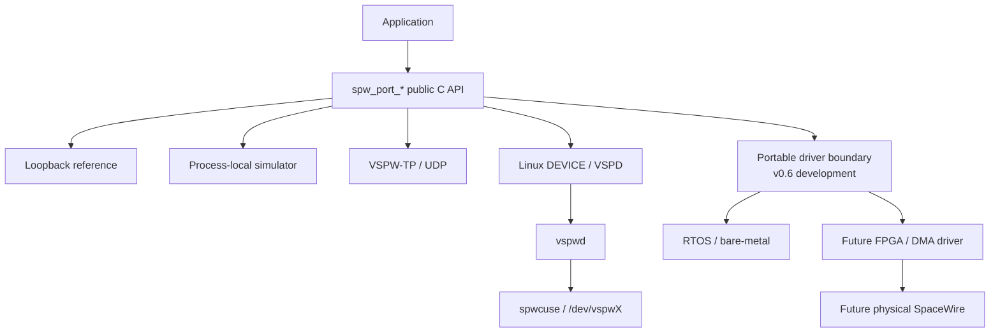

# SpWKit

[ExoSpaceLabs](https://github.com/ExoSpaceLabs)

**SpaceWire Development & Integration Toolkit**

SpWKit is a portable C11 SpaceWire software stack for simulation, distributed integration testing, Linux virtual devices, embedded/RTOS integration, and future hardware-backed links. Applications use one public SpaceWire-facing API while the implementation underneath can move from a deterministic simulator to UDP transport, a Linux virtual device, or a platform/vendor driver.



The runtime is C11. The optional C++17 layer is header-only and forwards to the same C ABI; it is a convenience surface, not a second implementation.

## Project status

### Stable: v0.5.1

`v0.5.1` is the current stable release. It is a maintenance update to the immutable `v0.5.0` hosted/embedded integration release and carries the same C ABI, backend behavior, VSPW-TP wire format, VSPD contract, and hardware-evidence boundary.

The maintenance release adds complete C++17 wrapper parity for the existing workspace and zero-copy ownership operations, plus executable simulator-backed ownership coverage. Release artifacts are published for:

- `amd64`;
- `arm64`;
- `armhf` / ARMv7;
- `riscv64`.

The corresponding runtime image is validated for `linux/amd64`, `linux/arm64`, `linux/arm/v7`, and `linux/riscv64`.

See [`docs/releases/v0.5.1.md`](docs/releases/v0.5.1.md) for the maintenance-release scope.

### Development: v0.6.0

The post-v0.5 development line uses `0.6.0` package/API metadata. `main` carries the current integration baseline and must contain all fixes already released on the v0.5 maintenance line; active v0.6 feature integration continues on `develop`.

Current v0.6 work includes:

- the portable `SPW_BACKEND_DRIVER` callback/configuration boundary;
- DMA/zero-copy ownership mapping through the existing `spw_buffer_t` contract;
- deterministic host reference-driver validation and no-heap evidence;
- CCSDSPack PUS-C interoperability through installed packages, Linux DEVICE/VSPD, VSPW-TP/UDP, and Docker Compose;
- provisional CCSDSPack integration against `CCSDSPack/develop` until a final user-approved immutable 2.x release baseline is selected;
- STM32H755 DMA/cache ownership validation as a separate hardware-evidence task;
- a public FPGA/driver interface boundary without publishing proprietary HDL, register maps, descriptors, or implementation details.

The v0.6 software boundary deliberately stops before claiming physical FPGA/SpaceWire interoperability. Physical HIL remains a separate evidence requirement.

## Stable v0.5 capabilities

- public C11 `spw_port_*` API with opaque handles;
- loopback reference backend;
- process-local two-peer SpaceWire simulator;
- distributed VSPW-TP/UDP backend;
- native POSIX and Windows/Winsock UDP runtime support;
- Linux `SPW_BACKEND_DEVICE` through VSPD/`vspwd`;
- optional CUSE `/dev/vspwX` presentation without adding libfuse to `libspwkit`;
- DATA packet boundaries with EOP/EEP preservation;
- time codes;
- link lifecycle/state, readiness, capabilities and statistics;
- deterministic virtual timing and transport fault injection;
- caller-owned/no-heap port construction;
- optional zero-copy ownership semantics;
- optional header-only C++17 wrapper;
- install/export support through `find_package(SpWKit)`;
- HardRT `0.4.0` POSIX and Cortex-M7 integration evidence;
- multi-architecture Debian and OCI validation.

## Backend matrix

| Backend | Linux | macOS | Windows | Embedded | Status |
|---|---:|---:|---:|---:|---|
| Loopback | yes | yes | yes | yes | stable |
| Process-local simulator | yes | yes | yes | no | stable |
| VSPW-TP / UDP | yes | yes | yes | transport-dependent | stable hosted |
| Linux DEVICE / VSPD | yes | no | no | no | stable |
| CUSE `/dev/vspwX` presenter | yes | no | no | no | stable optional service |
| Portable driver backend | development | development | development | development | v0.6 |

Backend source visibility is separate from runtime availability. Applications should handle `SPW_ERR_UNSUPPORTED` when a backend or optional capability is unavailable in a particular build.

## C API

The C API is authoritative.

```c
#include <spwkit/spwkit.h>

spw_port_config_t config = SPW_PORT_CONFIG_INITIALIZER(SPW_BACKEND_LOOPBACK);
spw_port_t *port = NULL;

if (spw_port_open(&config, &port) != SPW_OK) {
    return 1;
}
if (spw_port_start(port) != SPW_OK) {
    return 2;
}

/* send / receive packets, time codes, readiness, statistics, ... */

spw_port_stop(port);
spw_port_close(port);
```

For no-heap use, query workspace requirements and construct the port in caller-owned storage with `spw_port_open_in_place()`.

## Optional C++17 wrapper

Configure with `SPWKIT_ENABLE_CPP=ON` to install `<spwkit/spwkit.hpp>` and the `spwkit::cpp` CMake target.

```cpp
#include <spwkit/spwkit.hpp>

spw_port_config_t config = SPW_PORT_CONFIG_INITIALIZER(SPW_BACKEND_LOOPBACK);
spwkit::Port port;

if (spwkit::Port::open(config, port) != SPW_OK || port.start() != SPW_OK) {
    return 1;
}
```

The wrapper is move-only, RAII-based, exception-free, and forwards workspace, lifecycle, packet, readiness, statistics, time-code, and zero-copy ownership operations to the same C runtime.

## Build

Typical hosted build:

```sh
cmake -S . -B build \
  -DCMAKE_BUILD_TYPE=Release \
  -DSPWKIT_BUILD_TESTS=ON \
  -DSPWKIT_BUILD_EXAMPLES=ON \
  -DSPWKIT_ENABLE_CPP=ON
cmake --build build --parallel
ctest --test-dir build --output-on-failure
```

Pure-C/no-C++ builds remain supported:

```sh
CC=gcc CXX=/bin/false cmake -S . -B build-c \
  -DSPWKIT_BUILD_TESTS=ON \
  -DSPWKIT_BUILD_CPP_TESTS=OFF \
  -DSPWKIT_BUILD_CPP_EXAMPLES=OFF \
  -DSPWKIT_ENABLE_CPP=OFF
cmake --build build-c --parallel
ctest --test-dir build-c --output-on-failure
```

## Integration policy

`libspwkit` does not depend on HardRT or CCSDSPack at runtime.

- HardRT integration uses the released `ExoSpaceLabs/hardrt@0.4.0` baseline, corresponding to validated commit `1b861393cd7967ce5d0b3ac6f45928828a2d63aa`.
- CCSDSPack remains an optional integration/example dependency. Until its final 2.x baseline is explicitly approved, `CCSDSPack/develop` is only a provisional API/integration reference and is not a release dependency.

## Documentation

- [`docs/getting-started.md`](docs/getting-started.md) — build and first-use guide
- [`docs/api.md`](docs/api.md) — public API overview
- [`docs/simulator.md`](docs/simulator.md) — virtual SpaceWire and simulator model
- [`docs/language-bindings.md`](docs/language-bindings.md) — C/C++ integration model
- [`docs/platform-support.md`](docs/platform-support.md) — platform/runtime support
- [`docs/vspwd.md`](docs/vspwd.md) — Linux virtual-device service
- [`docs/backend-contract.md`](docs/backend-contract.md) — backend contract
- [`docs/current-status.md`](docs/current-status.md) — current implementation status
- [`docs/v0.6-scope.md`](docs/v0.6-scope.md) — v0.6 hardware-driver boundary

## Branch and release model

- `main` — current repository integration baseline;
- `develop` — active v0.6 feature integration;
- `release/0.5` — v0.5.x maintenance line;
- release tags are immutable.

## License

Apache-2.0. See [`LICENSE`](LICENSE) and [`NOTICE`](NOTICE).
