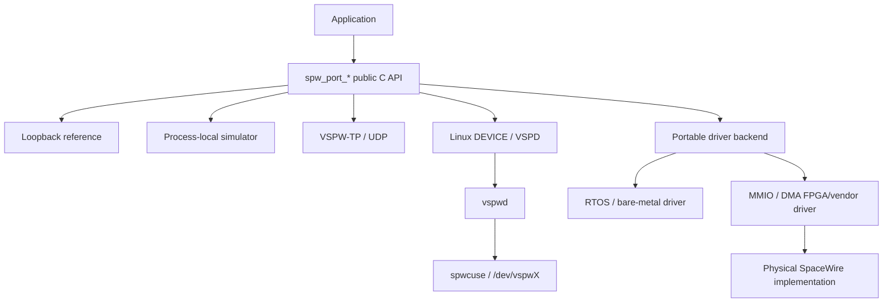
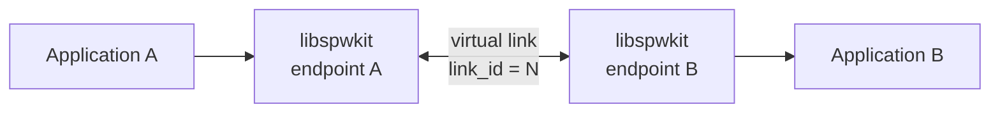
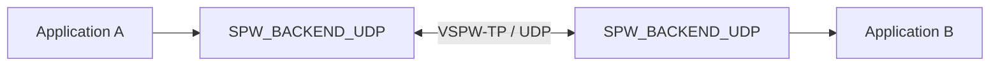
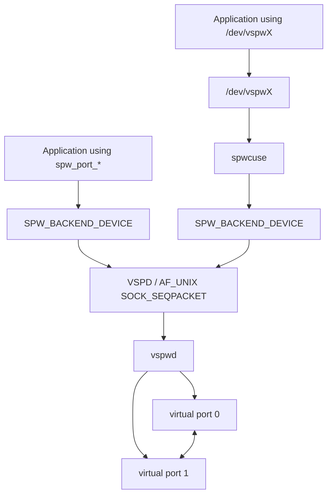

<p align="center">
  
</p>

<p align="center">
  <strong>SpaceWire Development & Integration Toolkit</strong><br>
  <a href="https://github.com/ExoSpaceLabs">ExoSpaceLabs</a>
</p>

SpWKit is a portable C11 SpaceWire software stack for simulation, distributed integration testing, Linux virtual devices, embedded/RTOS integration, and hardware-backed links. Applications use the same SpaceWire-facing API while the backend can move from a deterministic simulator to UDP, a Linux virtual device, or a platform/vendor driver.



The runtime is C11. The optional C++17 layer is header-only and forwards to the same C ABI; it is a convenience surface, not a second implementation.

## Project status

### Stable: v0.6.1

`v0.6.1` is a maintenance and performance-consolidation release on the v0.6 software contract. It preserves the public application/backend API while completing profiling metadata, incorporating accepted transport/readiness optimizations, and synchronizing the post-v0.6 documentation.

Highlights:

- process-local simulator plus distributed VSPW-TP/UDP transport;
- native POSIX and Windows/Winsock UDP runtime support behind `SPW_BACKEND_UDP`;
- Linux `SPW_BACKEND_DEVICE`, `vspwd`, `spwctl`, and `spwmon`;
- optional production CUSE `/dev/vspwX` presentation without adding libfuse to `libspwkit`;
- packet EOP/EEP preservation, time codes, link lifecycle/state, readiness, statistics, deterministic timing/fault support, and optional zero-copy ownership;
- C11 authoritative runtime with caller-owned/no-heap construction;
- optional header-only C++17 consumer layer;
- portable `SPW_BACKEND_DRIVER` callback/configuration contract;
- DMA-capable driver ownership mapped onto the existing `spw_buffer_t` API;
- deterministic reference-driver and freestanding/no-heap evidence;
- accepted CCSDSPack `v2.0.0` baseline at `c2f318c330c564429bcc565a8acbff22728b2851`;
- CCSDSPack PUS-C TC/TM interoperability over installed-package UDP, Linux DEVICE/VSPD, and a two-node Docker Compose topology;
- physical NUCLEO-H755ZI-Q Cortex-M7 DMA/cache/zero-copy qualification;
- completed profiling host/build/counter metadata and explicit backend coverage classification;
- controlled VSPW-TP 4096-byte RX paired overhead reduction from 60,281 to 25,032 invariant-TSC ticks (58.5%) after reassembly optimization;
- POSIX UDP and Linux DEVICE/VSPD optimistic-ready I/O paths that remove avoidable poll-first work while preserving timeout/error semantics;
- Debian/GHCR publication for `amd64`, `arm64`, `armhf`, and `riscv64` hosted targets.

See the [v0.6.1 release notes](docs/releases/v0.6.1.md) and [current project status](docs/current-status.md).

The v0.6 public boundary deliberately stops before proprietary FPGA/HDL implementation details and before physical SpaceWire PHY/electrical interoperability claims. Hosted profiling values are reference evidence for their named environments, not physical SpaceWire performance specifications.

## Supported backends

| Backend | Linux | macOS | Windows | Embedded | Status |
|---|---:|---:|---:|---:|---|
| Loopback | yes | yes | yes | yes | stable |
| Process-local simulator | yes | yes | yes | no | stable |
| VSPW-TP / UDP | yes | yes | yes | transport-dependent | stable hosted |
| Linux DEVICE / VSPD | yes | no | no | no | stable |
| CUSE `/dev/vspwX` presenter | yes | no | no | no | stable optional service |
| Portable driver backend | yes | yes | yes | yes | stable public integration boundary |

Backend source visibility is separate from runtime availability. Applications should handle `SPW_ERR_UNSUPPORTED` when a backend or optional capability is disabled in a particular build.

## Public API model

### C11

```c
#include <spwkit/spwkit.h>

spw_port_config_t config = SPW_PORT_CONFIG_INITIALIZER(SPW_BACKEND_LOOPBACK);
spw_port_t* port = NULL;

if (spw_port_open(&config, &port) != SPW_OK) {
    return 1;
}

if (spw_port_start(port) != SPW_OK) {
    spw_port_close(port);
    return 2;
}

uint8_t payload[] = {0x01, 0x02, 0x03};
spw_packet_t packet = {
    .data = payload,
    .length = sizeof(payload),
    .capacity = sizeof(payload),
    .terminator = SPW_TERMINATOR_EOP,
};

spw_result_t result = spw_port_send(port, &packet, SPW_TIMEOUT_IMMEDIATE);
spw_port_close(port);
return result == SPW_OK ? 0 : 3;
```

### C++17 convenience wrapper

```cpp
#include <spwkit/spwkit.hpp>

#include <array>
#include <cstdint>

spw_port_config_t config = SPW_PORT_CONFIG_INITIALIZER(SPW_BACKEND_LOOPBACK);
spwkit::Port port;

if (spwkit::Port::open(config, port) != SPW_OK || port.start() != SPW_OK) {
    return 1;
}

std::array<std::uint8_t, 3> payload{{0x01, 0x02, 0x03}};
if (port.send(payload.data(), payload.size(), SPW_TERMINATOR_EOP) != SPW_OK) {
    return 2;
}

return port.stop() == SPW_OK ? 0 : 3;
```

`spwkit::Port` forwards workspace requirements, in-place construction, readiness, time codes, statistics, fault statistics, and zero-copy acquire/submit/reclaim/release operations to the public C runtime. C ownership and result semantics remain authoritative.

Heap allocation is optional. Bare-metal/RTOS integrations can query workspace requirements and construct ports in caller-owned storage with `spw_port_open_in_place()` or `spwkit::Port::open_in_place()`.

## Virtual SpaceWire

### Process-local simulator

Two simulator ports with the same `link_id` and opposite A/B endpoint labels form equal peers. A/B are pairing labels, not server/client roles.



### Distributed UDP

Independent processes, containers, or hosts can exchange the same logical SpaceWire events over VSPW-TP/UDP.



UDP is only the carrier. Packet boundaries, EOP/EEP, time codes, session/retry behavior, virtual timing, and SpaceWire-side fault semantics remain SpWKit concepts.

### Linux virtual device

`vspwd` provides shared virtual SpaceWire endpoints for independent Linux processes. Applications can use the normal DEVICE backend, while `spwcuse` optionally presents a daemon port as a character device.



`spwctl` provides non-owning management and `spwmon` provides passive observation. CUSE/libfuse stays outside the public runtime ABI.

## Hardware driver boundary

`SPW_BACKEND_DRIVER` lets a platform/vendor driver implement the native controller side while applications remain on the ordinary SpWKit API.

The public contract covers:

- lifecycle and link state;
- complete DATA/EOP/EEP packets;
- time codes and readiness where supported;
- statistics and timeout/error mapping;
- copied I/O;
- zero-copy buffer ownership;
- optional DMA/cache synchronization hooks.

The public project intentionally does not standardize or publish private register maps, descriptor layouts, RTL architecture, internal bus/clock/reset/interrupt design, or electrical implementation details.

### STM32H755 evidence

The physical NUCLEO-H755ZI-Q qualification exercises real STM32 DMA2 and Cortex-M7 D-cache ownership through the public driver boundary. The final phase also proves that a TX buffer acquired before `spw_port_reset()` becomes stale afterward.

```text
magic                   = 0x53505736
phase                   = 0x0000700d
result                  = 0x00000000
sync_to_device          = 1
sync_from_device        = 1
dma_transfers           = 2
tx_packets              = 2
rx_packets              = 2
reset_stale_invalidated = 1
RESULT: PASS
```

This is real MCU DMA/cache evidence. It is not SpaceWire PHY/electrical HIL.

## CCSDSPack integration

CCSDSPack is an optional upper-layer integration dependency, not a dependency of `libspwkit`.

SpWKit v0.6 pins the interoperability fixture to:

```text
CCSDSPack v2.0.0
c2f318c330c564429bcc565a8acbff22728b2851
```

The integration serializes PUS-C TC/TM packets with CCSDSPack, transports the bytes unchanged through SpWKit, verifies byte identity, then parses/validates them on the receiver. The fixture covers independent-process UDP, Linux DEVICE/VSPD, and a two-node Docker Compose topology.

## Build

Typical hosted build:

```bash
cmake -S . -B build \
  -DSPWKIT_BUILD_TESTS=ON \
  -DSPWKIT_BUILD_EXAMPLES=ON
cmake --build build
ctest --test-dir build --output-on-failure
```

Enable the optional C++17 wrapper target explicitly when needed:

```bash
cmake -S . -B build-cpp \
  -DSPWKIT_ENABLE_CPP=ON \
  -DSPWKIT_BUILD_CPP_EXAMPLES=ON
cmake --build build-cpp
```

A freestanding/no-heap profile disables hosted backends and uses caller-owned workspace:

```bash
cmake -S . -B build-freestanding \
  -DSPWKIT_ENABLE_HEAP=OFF \
  -DSPWKIT_BUILD_SIMULATOR=OFF \
  -DSPWKIT_BUILD_UDP=OFF \
  -DSPWKIT_BUILD_DEVICE=OFF
cmake --build build-freestanding
```

## Installation and consumers

Stable v0.6 consumers use the exported C target:

```cmake
find_package(SpWKit 0.6 CONFIG REQUIRED)
target_link_libraries(my_app PRIVATE spwkit::spwkit)
```

When the package was built with `SPWKIT_ENABLE_CPP=ON`:

```cmake
find_package(SpWKit 0.6 CONFIG REQUIRED)
target_link_libraries(my_cpp_app PRIVATE spwkit::cpp)
```

Standalone installed-package examples live under `examples/installed*`, distributed peers under `examples/distributed*`, and upper-layer/platform integrations under `integrations/`.

## Binary releases

`v0.6.1` publishes Debian packages for:

```text
amd64
arm64
armhf
riscv64
```

The matching GHCR image supports:

```text
linux/amd64
linux/arm64
linux/arm/v7
linux/riscv64
```

See [binary release artifacts](docs/binary-packages.md).

## Development and release flow


`main` is the stable line. `develop` carries subsequent integration work. Temporary feature/release branches are deleted after integration; tags and releases preserve release history.

The tag-triggered Release workflow requires the tagged commit to be the exact `main` head before publishing artifacts.

## Standards scope

The primary design reference is **ECSS-E-ST-50-12C Rev.1, SpaceWire - Links, nodes, routers and networks (15 May 2019)**. Related ECSS SpaceWire standards cover protocol identification, RMAP, and CCSDS packet transfer.

SpWKit uses these standards as design references. The project does **not** claim formal ECSS conformance or certification until implemented behavior is backed by explicit requirements traceability and verification evidence.

## Documentation

- [Getting started](docs/getting-started.md)
- [Public API](docs/api.md)
- [Architecture](docs/architecture.md)
- [Backend contract](docs/backend-contract.md)
- [Configuration](docs/configuration.md)
- [Platform support](docs/platform-support.md)
- [Memory and portability](docs/memory.md)
- [Zero-copy buffers](docs/buffers.md)
- [C++ wrapper and language bindings](docs/language-bindings.md)
- [Simulator](docs/simulator.md)
- [VSPW-TP](docs/vspw-tp.md)
- [Linux VSPD device protocol](docs/vspw-device-protocol.md)
- [`vspwd`](docs/vspwd.md)
- [CUSE presenter](docs/cuse.md)
- [Driver backend](docs/driver-backend.md)
- [Hardware acceptance](docs/hardware-acceptance.md)
- [Testing](docs/testing.md)
- [Roadmap](docs/roadmap.md)

## Scope of compliance claims

SpWKit models and transports software-visible SpaceWire packet/link semantics and now has real MCU driver/DMA/cache evidence. Automated simulation, transport, RTOS, package, compile/link, and STM32 DMA evidence are not substitutes for physical SpaceWire electrical interoperability or formal qualification. No claim of real FPGA SpaceWire HIL is made until matching hardware exists and the corresponding HIL suite is executed against it.

## License

Apache-2.0. See [LICENSE](LICENSE), [NOTICE](NOTICE), and [CONTRIBUTING.md](CONTRIBUTING.md).
