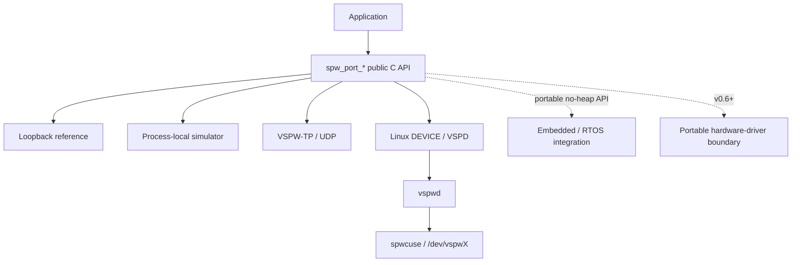
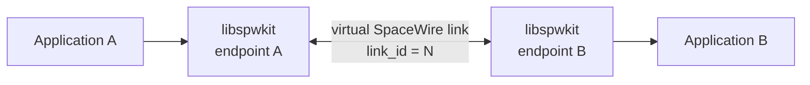
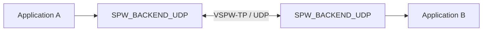
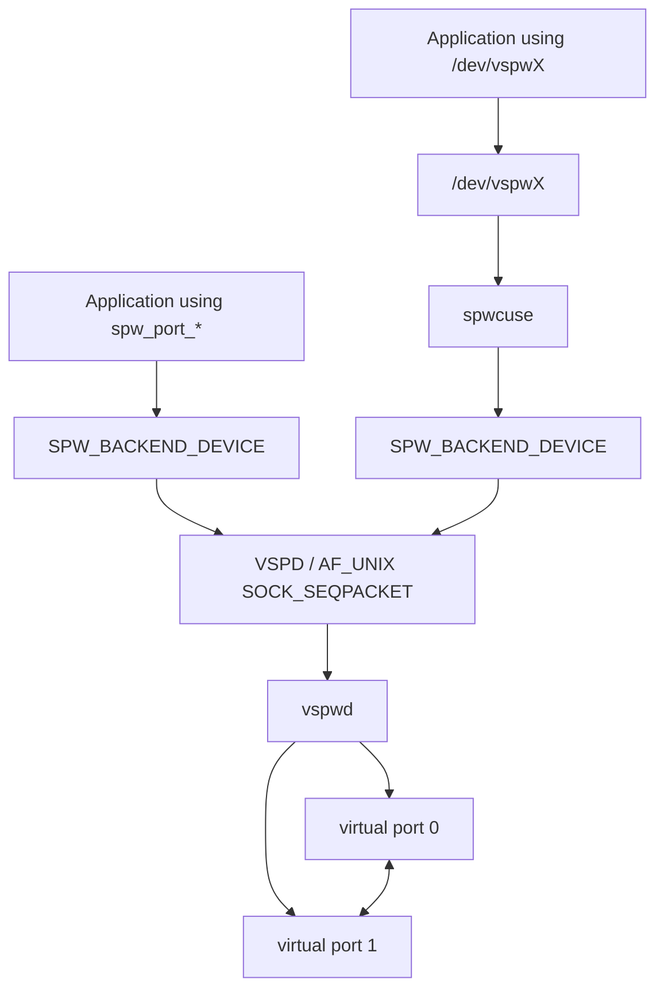

<p align="center">
  
</p>

<p align="center">
  <strong>SpaceWire Development & Integration Toolkit</strong><br>
  <a href="https://github.com/ExoSpaceLabs">ExoSpaceLabs</a>
</p>

SpWKit is a portable C11 SpaceWire software stack for simulation, distributed integration testing, Linux virtual devices, embedded/RTOS integration, and future hardware-backed links. Applications keep the same SpaceWire-facing API while the implementation underneath can move between deterministic simulation, UDP transport, Linux virtual devices, and platform-specific integration.



The runtime is C11. The optional C++17 layer is header-only and forwards to the same C ABI; it is a convenience surface, not a second implementation.

## Project status

### Stable: v0.5.1

`v0.5.1` is the current stable maintenance release. It keeps the v0.5 C ABI and backend behavior unchanged while completing parity in the optional C++17 wrapper for workspace and zero-copy operations.

Stable highlights:

- deterministic loopback and process-local SpaceWire simulation;
- distributed VSPW-TP/UDP transport for independent processes, containers, and hosts;
- POSIX and Windows/Win32 UDP runtime support behind the same `SPW_BACKEND_UDP` API;
- Linux `SPW_BACKEND_DEVICE`, `vspwd`, `spwctl`, and `spwmon`;
- optional CUSE `/dev/vspwX` presentation through `spwcuse`, without adding libfuse3 to `libspwkit`;
- packet EOP/EEP preservation, time codes, link lifecycle/state, readiness, statistics, deterministic timing/fault support, and optional zero-copy ownership;
- caller-owned/no-heap construction for embedded and RTOS-oriented integrations;
- optional header-only C++17 consumer layer;
- HardRT POSIX and Cortex-M integration evidence;
- release packages for `amd64`, `arm64`, `armhf`, and `riscv64`.

See the [v0.5.1 release notes](docs/releases/v0.5.1.md).

### Development: v0.6.0

Active hardware-driver and DMA integration work lives on `develop`. The stable branch does not claim a physical FPGA SpaceWire implementation or physical SpaceWire HIL evidence.

## Supported backends

| Backend | Linux | macOS | Windows | Embedded | Status |
|---|---:|---:|---:|---:|---|
| Loopback | yes | yes | yes | yes | stable |
| Process-local simulator | yes | yes | yes | no | stable |
| VSPW-TP / UDP | yes | yes | yes | transport-dependent | stable hosted |
| Linux DEVICE / VSPD | yes | no | no | no | stable |
| CUSE `/dev/vspwX` presenter | yes | no | no | no | stable optional service |

Backend source visibility is separate from runtime availability. Applications should handle `SPW_ERR_UNSUPPORTED` when a backend or optional capability is disabled in a particular build.

## Public API model

### C11

```c
#include <spwkit/spwkit.h>

spw_port_config_t config = SPW_PORT_CONFIG_INITIALIZER(SPW_BACKEND_LOOPBACK);
spw_port_t* port = NULL;

if (spw_port_open(&config, &port) != SPW_OK) {
    return 1;
}

if (spw_port_start(port) != SPW_OK) {
    spw_port_close(port);
    return 2;
}

uint8_t payload[] = {0x01, 0x02, 0x03};
spw_packet_t packet = {
    .data = payload,
    .length = sizeof(payload),
    .capacity = sizeof(payload),
    .terminator = SPW_TERMINATOR_EOP,
};

spw_result_t result = spw_port_send(port, &packet, SPW_TIMEOUT_IMMEDIATE);
spw_port_close(port);
return result == SPW_OK ? 0 : 3;
```

### C++17 convenience wrapper

```cpp
#include <spwkit/spwkit.hpp>

#include <array>
#include <cstdint>

spw_port_config_t config = SPW_PORT_CONFIG_INITIALIZER(SPW_BACKEND_LOOPBACK);
spwkit::Port port;

if (spwkit::Port::open(config, port) != SPW_OK || port.start() != SPW_OK) {
    return 1;
}

std::array<std::uint8_t, 3> payload{{0x01, 0x02, 0x03}};
if (port.send(payload.data(), payload.size(), SPW_TERMINATOR_EOP) != SPW_OK) {
    return 2;
}

return port.stop() == SPW_OK ? 0 : 3;
```

Heap allocation is optional. Embedded and RTOS-oriented integrations can query workspace requirements and construct ports in caller-owned storage with `spw_port_open_in_place()`.

## Virtual SpaceWire

### Process-local simulator

Two simulator ports with the same `link_id` and opposite A/B endpoint labels form equal peers. A/B are pairing labels, not server/client roles.



The simulator preserves packets, EOP/EEP terminators, time codes, link lifecycle, bounded queues, timing, statistics, and zero-copy ownership semantics without physical hardware.

### Distributed UDP

Independent processes, containers, or hosts can exchange the same logical SpaceWire events over VSPW-TP/UDP.



UDP is the carrier, not the public protocol model. Packet boundaries, EOP/EEP, time codes, session/retry behavior, virtual timing, and SpaceWire-side fault semantics remain SpWKit concepts.

### Linux virtual device

`vspwd` provides shared virtual SpaceWire endpoints for independent Linux processes. Applications can use the normal DEVICE backend, while `spwcuse` can optionally present a daemon port as a character device.



`spwctl` provides non-owning management and `spwmon` provides passive observation. CUSE/libfuse remains outside the public runtime ABI.

## Build

Typical hosted build:

```bash
cmake -S . -B build \
  -DSPWKIT_BUILD_TESTS=ON \
  -DSPWKIT_BUILD_EXAMPLES=ON
cmake --build build
ctest --test-dir build --output-on-failure
```

Enable the optional C++17 wrapper when needed:

```bash
cmake -S . -B build-cpp \
  -DSPWKIT_ENABLE_CPP=ON \
  -DSPWKIT_BUILD_CPP_EXAMPLES=ON
cmake --build build-cpp
```

A freestanding/no-heap profile disables hosted backends and uses caller-owned workspace:

```bash
cmake -S . -B build-freestanding \
  -DSPWKIT_ENABLE_HEAP=OFF \
  -DSPWKIT_BUILD_SIMULATOR=OFF \
  -DSPWKIT_BUILD_UDP=OFF \
  -DSPWKIT_BUILD_DEVICE=OFF
cmake --build build-freestanding
```

## Installation

Stable v0.5 consumers use the exported C target:

```cmake
find_package(SpWKit 0.5 CONFIG REQUIRED)
target_link_libraries(my_app PRIVATE spwkit::spwkit)
```

Optional C++17 consumers link the header-only wrapper target:

```cmake
find_package(SpWKit 0.5 CONFIG REQUIRED)
target_link_libraries(my_cpp_app PRIVATE spwkit::cpp)
```

Standalone installed-package examples live under `examples/installed*`; distributed peers live under `examples/distributed*`.

## Binary releases

`v0.5.1` publishes Debian packages for:

```text
amd64
arm64
armhf
riscv64
```

The corresponding runtime image follows the same supported Linux architecture set. See [binary release artifacts](docs/binary-packages.md).

## Development and release flow


`main` is the stable line. `develop` carries the next release. Temporary feature/release branches are deleted after integration; tags and releases preserve release history.

Physical HIL remains separate from hosted CI until appropriate SpaceWire/FPGA hardware exists and the corresponding harness is executed.

## Standards scope

The primary design reference is **ECSS-E-ST-50-12C Rev.1, SpaceWire - Links, nodes, routers and networks (15 May 2019)**. Related ECSS SpaceWire standards cover protocol identification, RMAP, and CCSDS packet transfer.

SpWKit uses these standards as design references. The project does **not** claim formal ECSS conformance or certification until implemented behavior is backed by explicit requirements traceability and verification evidence.

## Documentation

- [Getting started](docs/getting-started.md)
- [Public API](docs/api.md)
- [Architecture](docs/architecture.md)
- [Backend contract](docs/backend-contract.md)
- [Configuration](docs/configuration.md)
- [Platform support](docs/platform-support.md)
- [Memory and portability](docs/memory.md)
- [Zero-copy buffers](docs/buffers.md)
- [C++ wrapper and language bindings](docs/language-bindings.md)
- [Simulator](docs/simulator.md)
- [VSPW-TP](docs/vspw-tp.md)
- [Linux VSPD device protocol](docs/vspw-device-protocol.md)
- [`vspwd`](docs/vspwd.md)
- [CUSE presenter](docs/cuse.md)
- [Testing](docs/testing.md)
- [Roadmap](docs/roadmap.md)

## Scope of compliance claims

SpWKit models and transports software-visible SpaceWire packet/link semantics. Automated simulation, transport, RTOS, package, and compile/link evidence is not a substitute for physical electrical interoperability or qualification evidence. No claim of real FPGA SpaceWire HIL is made until matching hardware exists and the HIL suite is executed against it.

## License

Apache-2.0. See [LICENSE](LICENSE), [NOTICE](NOTICE), and [CONTRIBUTING.md](CONTRIBUTING.md).
