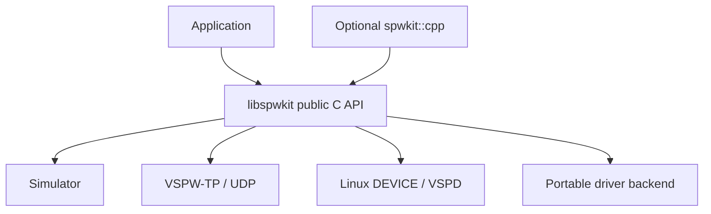

# Public API contract

SpWKit uses a C11 ABI as the portability baseline. C++ applications may call it directly or use the optional header-only C++17 convenience wrapper.

## Design rule

Applications interact with **SpWKit**, not directly with simulator queues, sockets, VSPD, CUSE, DMA engines, RTOS primitives, FPGA registers, or vendor SDKs.



## ABI primitives

`spw_result_t` is a fixed-width signed 32-bit result type. `spw_timeout_us_t` is an unsigned 64-bit timeout expressed in microseconds. `spw_port_t` and `spw_buffer_t` are opaque.

Public operation signatures do not expose POSIX descriptors, socket handles, RTOS objects, DMA addresses/descriptors, AXI/MMIO values, C++ classes, or vendor SDK handles.

## Canonical runtime semantics

[`runtime-contract.md`](runtime-contract.md) is the authoritative application/provider contract for threading, handle lifetime, result codes, timeout budgets, link-state behavior, zero-copy reset epochs and resource limits.

The portable 1.x rules include:

- distinct `spw_port_t` handles may be operated concurrently;
- public calls using one port handle must be serialized by the application;
- `stop`, `reset` and `close` are lifecycle operations, not asynchronous cancellation primitives;
- successful reset invalidates pre-reset zero-copy ownership handles/completions;
- `SPW_TIMEOUT_IMMEDIATE` performs no deliberate wait, finite values bound the whole public operation, and `SPW_TIMEOUT_INFINITE` does not suppress terminal errors;
- local lifecycle misuse is `SPW_ERR_INVALID_STATE`, while a started/connecting/recovering endpoint that lacks its required peer/link reports `SPW_ERR_LINK_UNAVAILABLE`.

Backend-specific documents may state stronger behavior, but portable applications must not depend on guarantees stronger than the canonical runtime contract.

## Port lifecycle and construction

```text
spw_port_workspace_requirements
spw_port_open_in_place
spw_port_open
spw_port_close
spw_port_start
spw_port_stop
spw_port_reset
```

`spw_port_open_in_place()` is the allocation-free construction path using caller-owned workspace. `spw_port_open()` is a hosted convenience path and may be disabled with `SPWKIT_ENABLE_HEAP=OFF`.

## Backend selection

`spw_port_config_t` selects an implementation and carries an optional backend-specific configuration object.

Current public backend IDs are:

```text
SPW_BACKEND_LOOPBACK
SPW_BACKEND_SIMULATOR
SPW_BACKEND_UDP
SPW_BACKEND_DEVICE
SPW_BACKEND_DRIVER
```

Runtime availability is platform/build dependent. A source-visible backend may return `SPW_ERR_UNSUPPORTED` when its implementation is unavailable in that build.

- `SPW_BACKEND_SIMULATOR` provides a process-local equal-peer virtual link.
- `SPW_BACKEND_UDP` provides VSPW-TP over POSIX UDP or native Windows/Winsock.
- `SPW_BACKEND_DEVICE` attaches Linux applications to `vspwd` through VSPD.
- `SPW_BACKEND_DRIVER` is the portable platform/vendor driver boundary introduced in v0.6 and retained by the stable v0.6.1 line.

## Link state

`spw_port_get_link_state()` reports `spw_link_state_t`. Backends map observable implementation state into the common SpaceWire-oriented vocabulary and are not required to invent transient states they cannot meaningfully observe.

Successful `spw_port_start()` requests startup; asynchronous/distributed backends may still report `CONNECTING` before `RUN`. Successful reset returns the local endpoint to `ERROR_RESET`. Successful stop leaves it non-RUN.

## Capabilities

`spw_port_get_capabilities()` declares optional functionality and bounded resources. Capability areas include:

- EEP;
- time codes;
- link control;
- statistics;
- rate/timing control;
- deterministic fault injection;
- readiness;
- zero-copy ownership.

Advertised optional capabilities become part of that backend's executable contract.

## Copied packet transfer

```text
spw_port_send
spw_port_receive
```

A `spw_packet_t` represents one complete software-visible SpaceWire packet with payload length/capacity and EOP/EEP termination. Packet ownership remains with the caller during copied I/O.

Backends may internally copy, fragment/reassemble, queue, or use DMA, but those implementation details never become partial application packets.

A non-empty copied packet requires valid caller storage. Null non-empty payload/destination storage is `SPW_ERR_INVALID_ARGUMENT`; invalid packet metadata/shape is `SPW_ERR_INVALID_PACKET`.

### Receive-capacity rule

SpWKit never silently truncates a complete packet. If the next packet exceeds caller capacity:

- `SPW_ERR_BUFFER_TOO_SMALL` is returned;
- required complete length and terminator are reported;
- caller payload storage is not partially overwritten;
- the packet remains available for retry.

## Readiness

Backends advertising `SPW_CAP_READINESS` support:

```text
spw_port_wait
```

Readiness is level-triggered and non-consuming. The subsequent receive API consumes the event.

## Zero-copy ownership

Backends advertising `SPW_CAP_ZERO_COPY` expose the ownership-oriented API from `spwkit/buffer.h`.


Concrete operations are:

```text
spw_buffer_get_view
spw_buffer_set_packet
spw_port_acquire_tx_buffer
spw_port_submit_tx_buffer
spw_port_reclaim_tx_buffer
spw_port_release_tx_buffer
spw_port_acquire_rx_buffer
spw_port_release_rx_buffer
```

Successful submit/release operations clear the caller's buffer pointer. Failed ownership-transfer operations do not steal application ownership.

A buffer is single-owner application state, not a concurrently shared object. It may be handed between application threads/tasks through explicit application synchronization. Successful reset starts a new ownership epoch, making every pre-reset buffer handle/completion from that port stale.

The public contract models ownership, not DMA representation. Simulator buffers may be ordinary aligned host memory; `SPW_BACKEND_DRIVER` can map the same lifecycle to DMA-capable vendor buffers without exposing physical addresses or descriptors.

## Time codes

```text
spw_port_send_time_code
spw_port_receive_time_code
```

Time codes remain separate logical events rather than DATA payload bytes. Backends that do not support them must not advertise the capability. The common API accepts time counts `0..63`; non-zero control flags remain reserved by the current public time-code profile.

## Statistics and faults

```text
spw_port_get_statistics
spw_port_clear_statistics
spw_port_get_fault_statistics
spw_port_clear_fault_statistics
```

Fault statistics are optional and separate VSPW-TP carrier faults from explicitly SpaceWire-visible faults such as injected EEP.

## C++17 convenience wrapper

`<spwkit/spwkit.hpp>` provides `spwkit::Port`, a move-only RAII wrapper over `spw_port_t`.

It forwards:

- workspace requirement queries and hosted/in-place open;
- lifecycle and link/capability queries;
- readiness;
- copied packet I/O;
- time codes;
- statistics/fault statistics;
- zero-copy buffer acquire/submit/reclaim/release;
- buffer view and packet-metadata operations.

The C API remains authoritative. The wrapper adds no exceptions, RTTI-dependent behavior, allocator model, synchronization policy, or backend implementation.

## Distributed UDP backend


VSPW-TP v1 provides bounded fragmentation/reassembly, EOP/EEP preservation, time codes, session/liveness, ACK/retry/deduplication, arbitrary-order reassembly, virtual timing, and deterministic fault injection. POSIX and Winsock runtimes implement the same public and wire contracts.

## Linux virtual-device backend


Linux device applications still use `spw_port_*`. `/dev/vspwX` is an optional v0.5 CUSE presentation implemented by `spwcuse`, not a replacement public runtime API.

## Portable driver backend

`SPW_BACKEND_DRIVER` delegates to a caller-owned `spw_driver_ops_t`/context. Required and optional driver callbacks are capability-gated. Driver ABI v2 maps DMA buffers onto the existing zero-copy contract while keeping native hardware details private.

DRIVER callbacks execute synchronously inside the triggering public call. They must not re-enter the same SpWKit port; providers that share native state across multiple DRIVER ports own the synchronization of that shared state.

## Blocking and timeouts

Packet, time-code, readiness and buffer-completion operations use the common microsecond timeout model. Implementations may use condition variables, socket polling, RTOS events, interrupts, hardware queues or polling loops below the API.

`SPW_TIMEOUT_IMMEDIATE` requests non-blocking behavior. A finite timeout bounds the whole public operation rather than each internal retry. `SPW_TIMEOUT_INFINITE` requests an unbounded wait where supported but still permits terminal state/link/backend errors to return.

## Versioning

The C ABI exposes major/minor/patch macros. Before v1.0, incompatible changes remain possible but must update implementation, tests and documentation together.

Release tags identify immutable coherent milestones. `develop` is the active integration branch; `main` is the release boundary. Documentation must distinguish stable release capability from unreleased `develop` work.
