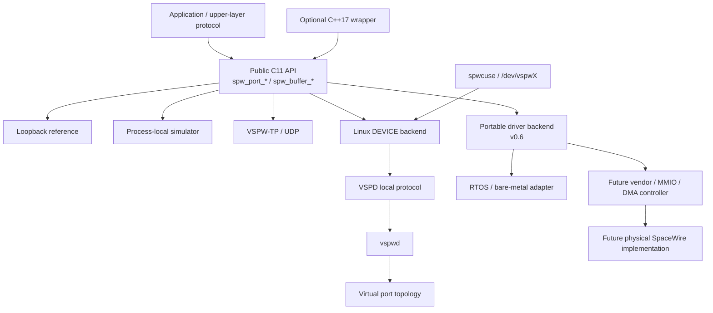
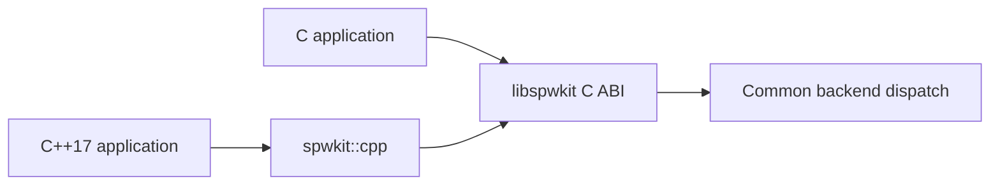
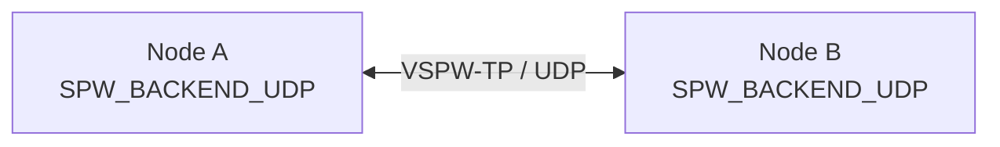
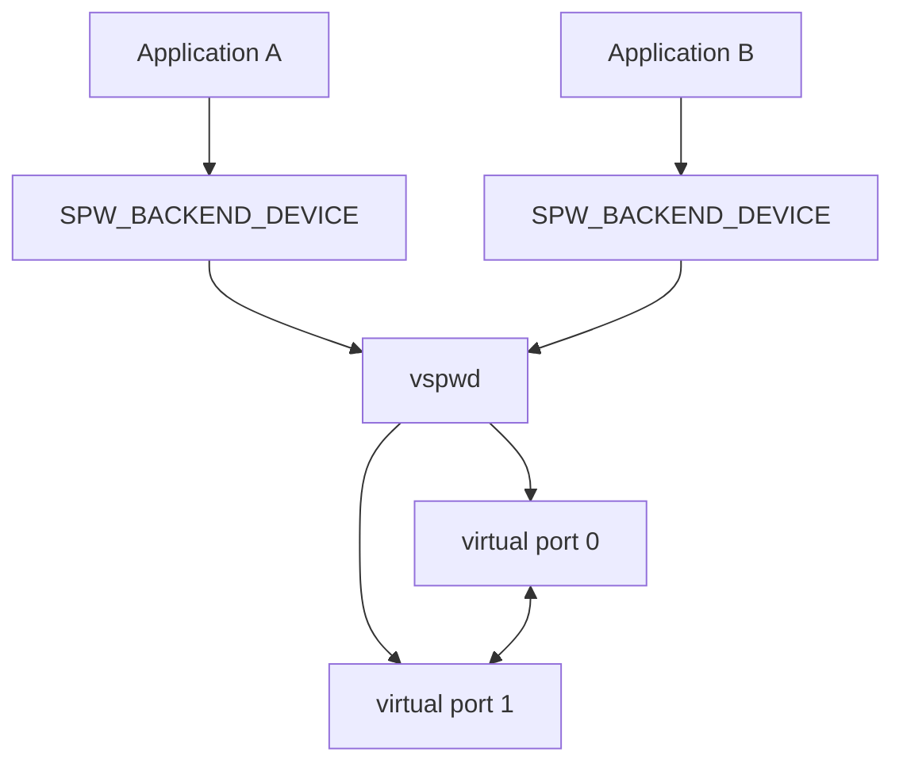
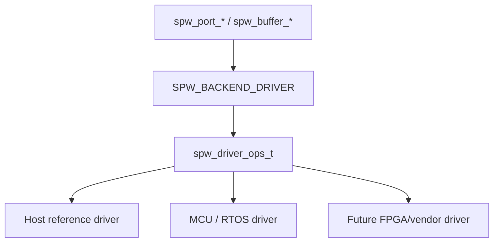
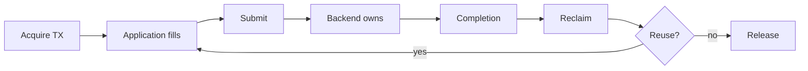
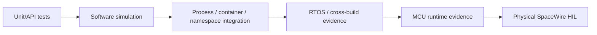

# Architecture

SpWKit keeps one SpaceWire-facing application contract above several interchangeable software and hardware integration backends.

## Layer model



The application does not switch APIs when it moves between these paths. Backend-specific configuration selects an implementation; packet boundaries, EOP/EEP, link state, time codes, result values, timeout rules and optional buffer ownership remain common concepts.

## Authoritative runtime boundary

`libspwkit` is C11. The public C ABI is the portability and binary-compatibility baseline.

The optional `spwkit::cpp` target is header-only. It provides RAII for `spw_port_t` plus thin forwarding for lifecycle, copied I/O, readiness, time codes, statistics, workspace construction and zero-copy ownership. It contains no backend implementation and introduces no second runtime.



## Backend families

### Loopback

A deterministic single-port reference implementation used to validate the mandatory contract and bounded-resource behavior. It is not a SpaceWire network simulator.

### Process-local simulator

Two equal peers with a shared `link_id` and opposite A/B pairing labels. It models packet/link behavior, time codes, bounded queues, disconnect/recovery and zero-copy ownership semantics without modeling Data-Strobe/LVDS signal behavior.

### VSPW-TP / UDP

Distributed virtual SpaceWire carried over IPv4 UDP. The same public backend contract is implemented by POSIX sockets on Unix-like hosts and native Winsock on Windows.



VSPW-TP preserves logical packet identity across fragmentation/reassembly and transports time codes, liveness and acknowledgements separately. UDP loss/reordering is a transport concern; it is not automatically interpreted as a SpaceWire EEP or electrical/link fault.

### Linux virtual device

Linux applications that require independent processes can attach to `vspwd` through `SPW_BACKEND_DEVICE` and the private VSPD protocol.



`spwctl` uses a non-owning management plane, while `spwmon` passively subscribes to bounded daemon state snapshots.

Since v0.5, `spwcuse` can additionally present a `vspwd` port as a real Linux CUSE character device such as `/dev/vspw0`. The character-device record ABI remains packet-oriented so DATA boundaries, EOP/EEP and time codes are not flattened into a UART-like byte stream.

```mermaid
flowchart LR
    RAW[Device-node application] --> NODE[/dev/vspw0]
    NODE --> CUSE[spwcuse]
    CUSE --> DEV[SPW_BACKEND_DEVICE]
    DEV --> D[vspwd]
```

CUSE/libfuse is confined to the separate presenter process and is not a dependency of `libspwkit`.

### Portable driver backend

`SPW_BACKEND_DRIVER` is the v0.6 software boundary for vendor, MCU and future FPGA drivers. Applications still call the normal public API; SpWKit delegates through `spw_driver_ops_t` to a caller-owned driver context.



Driver ABI v2 maps DMA-capable buffers onto the same opaque `spw_buffer_t` ownership lifecycle used by the simulator. Physical addresses, descriptor layouts and vendor handles do not cross the application ABI.

## Packet data path

Copied I/O keeps storage ownership with the caller during each call:


Backends advertising `SPW_CAP_ZERO_COPY` may instead use explicit ownership transitions:



The same application-visible ownership sequence can be backed by fixed simulator memory or by DMA-capable hardware buffers.

## Embedded and RTOS model

SpWKit does not require POSIX or heap allocation at the core API boundary. `spw_port_workspace_requirements()` plus `spw_port_open_in_place()` allow caller-owned construction. The driver boundary can therefore be used from bare metal or an RTOS without exposing scheduler primitives in the public API.

HardRT `0.4.0` is the current validated external RTOS integration baseline. CI provides POSIX execution evidence and Cortex-M7 compile/link evidence; it does not claim STM32H755 runtime or physical SpaceWire HIL.

## Hardware and FPGA stop line

The public repository defines only the software contract a future hardware driver must satisfy. It does not publish or guess proprietary implementation details such as:

- RTL architecture;
- register/address maps;
- DMA descriptor formats;
- internal bus topology;
- clock/reset/interrupt design;
- vendor IP selection.

A future physical backend must translate its own controller model into the public packet/link/ownership semantics and then pass the reusable backend contract plus hardware-specific HIL evidence.

## Evidence boundaries



Passing an earlier layer does not imply a later one. In particular, QEMU/cross-link, Docker networking, CUSE, or STM32 memory-to-memory DMA do not constitute SpaceWire electrical interoperability.
