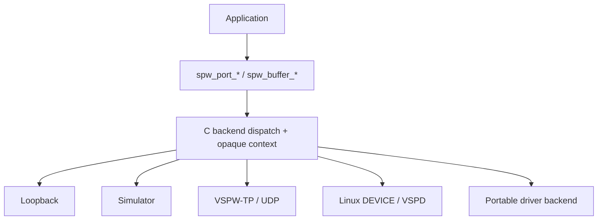
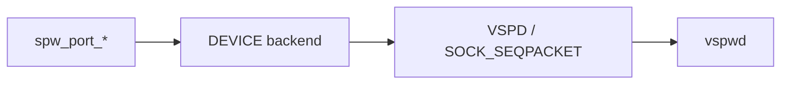
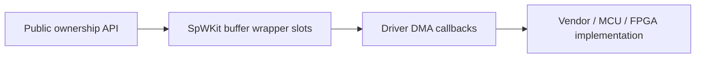

# Backend contract

This document defines the internal boundary used by `libspwkit` to implement one public SpaceWire-facing contract across different transports and hardware adapters.

Applications do not use backend objects directly.

## Mandatory operations

The internal contract covers:

- construction/destruction of backend context;
- link start/stop/reset;
- link-state query;
- capability query;
- copied packet send/receive;
- common timeout/result behavior.

Time codes, statistics, readiness, fault diagnostics and zero-copy ownership are capability-gated. A backend that advertises one of those capabilities must implement the matching observable contract.

Backend polymorphism is a C function-pointer table plus opaque context. No C++ class hierarchy is required by the runtime.

## Invariants

Every backend must preserve these application-visible rules:

- complete packet boundaries are never exposed as internal transport fragments;
- EOP and EEP remain distinguishable;
- receive never silently truncates a packet;
- an undersized receive leaves the complete packet available for retry;
- optional behavior matches advertised capabilities;
- link state maps into the common SpaceWire-oriented state model;
- common statistics retain documented meanings;
- implementation-native types do not leak into common operation signatures;
- failed ownership-transfer calls do not steal application-owned buffers.

## Allocation policy

The backend interface does not require heap allocation. `spw_port_open_in_place()` constructs the port and selected backend inside caller-owned storage sized by `spw_port_workspace_requirements()`.

Hosted backends may use operating-system services internally, but those services must not change common application ownership semantics. Embedded/driver paths can use static memory, polling, interrupts, RTOS primitives or hardware queues underneath the same contract.

## Loopback

Loopback is the deterministic mandatory-contract reference path. It validates dispatch, packet/error semantics, bounded queues, EOP/EEP, time codes and statistics without claiming to be a SpaceWire network simulator.

## Process-local simulator

The simulator provides equal A/B peers paired by `link_id` and adds:

- peer lifecycle and reconnect behavior;
- bounded independent packet/time-code queues;
- finite/infinite waits using private host synchronization;
- zero-copy ownership emulation using fixed aligned host-memory buffers.

It is the deterministic behavioral reference for software-visible virtual SpaceWire semantics, not a Data-Strobe/LVDS simulator.

## Distributed UDP

The UDP backend maps the common contract onto VSPW-TP datagrams. The transport runtime is POSIX on Unix-like hosts and native Winsock on Windows; the wire/public semantics are identical.

It provides bounded fragmentation/reassembly, EOP/EEP, time codes, ACK/retry/deduplication, session/liveness, virtual timing and deterministic fault injection. Transport fragments never surface through `spw_port_receive()`.

## Linux DEVICE / VSPD

`SPW_BACKEND_DEVICE` maps the same contract onto the private VSPD protocol and `vspwd` service.

Unix sockets and daemon framing stay private. v0.5 additionally ships `spwcuse`, which uses the public DEVICE backend internally to present `/dev/vspwX`; CUSE types remain outside `libspwkit`.

## Portable driver backend

`SPW_BACKEND_DRIVER` is the v0.6 boundary for vendor, MCU, RTOS and future FPGA drivers. SpWKit calls a user-supplied `spw_driver_ops_t` over a caller-owned driver context.

Driver ABI v2 maps driver-owned DMA buffers onto the existing public zero-copy ownership lifecycle. CPU-visible data views and opaque tokens may cross the driver callback boundary; physical addresses and native descriptors do not enter the public application ABI.

## Receive capacity

If the next complete packet exceeds caller receive capacity:

- return `SPW_ERR_BUFFER_TOO_SMALL`;
- report required complete length and terminator;
- do not partially modify caller storage;
- retain the complete packet for a later adequate receive.

## Timeouts

Timeouts use the common microsecond type. Backend implementations may wait through condition variables, sockets, RTOS events, interrupts, hardware queues or polling loops. Those mechanisms are not public API concerns.

## Testing

Every backend reuses the shared public backend contract for each capability it advertises. Additional tests may verify implementation-specific concerns such as VSPW-TP framing, VSPD protocol behavior, CUSE record presentation or DMA ownership, but they do not replace the common contract.

Current CI exercises loopback, simulator, POSIX/Winsock UDP, Linux DEVICE/VSPD, the portable reference driver, no-heap profiles and installed C/C++ consumers. Physical STM32/FPGA/HIL evidence remains a separate claim.
