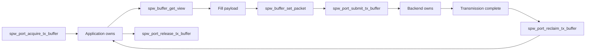
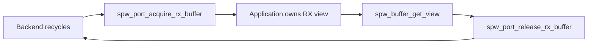
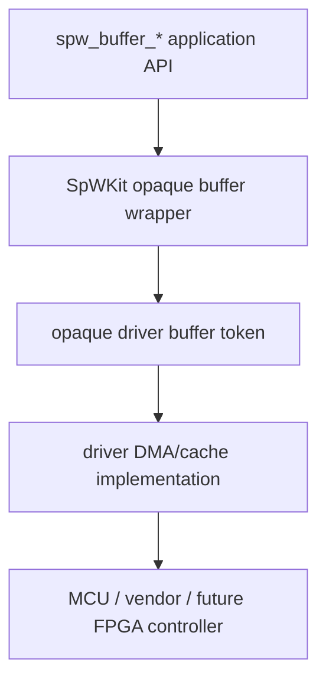

# Zero-copy buffer ownership

SpWKit provides a capability-gated zero-copy ownership API for backends that can benefit from backend-managed buffers while preserving the same packet/EOP/EEP semantics as copied I/O.

The public API models **ownership**, not DMA descriptors or physical memory.

## Capability

Applications must query `SPW_CAP_ZERO_COPY` before using zero-copy operations. A backend that does not advertise the capability returns `SPW_ERR_UNSUPPORTED` for those operations.

## Public types

`spw_buffer_t` is opaque. Applications inspect an owned buffer through `spw_buffer_view_t` using `spw_buffer_get_view()`.

A view contains CPU-visible data, capacity, current length and terminator metadata. It does not expose physical addresses, descriptor rings, vendor handles or mapping objects.

## TX lifecycle



On successful submit, the caller's buffer pointer is cleared. On failed submit, ownership remains with the application and the pointer is unchanged.

A reclaimed TX buffer is application-owned again and may be refilled/resubmitted or released back to the backend pool.

## RX lifecycle



RX packet metadata is backend-produced. Releasing a successfully acquired RX buffer consumes that received packet and clears the caller pointer.

## Packet metadata

`spw_buffer_set_packet()` is valid only for application-owned TX buffers. It sets the payload length and EOP/EEP terminator before submission.

The requested length must not exceed acquired capacity. RX metadata is not application-writable through this operation.

## Ownership errors

The ownership contract is deliberately strict:

- a buffer belongs to one port/backend;
- a foreign-port release/submit is rejected;
- double release/submit is rejected by the underlying ownership state;
- failed ownership-transfer operations preserve application ownership;
- buffer tokens/views are valid only according to the documented ownership phase.

## Simulator implementation

The process-local simulator advertises `SPW_CAP_ZERO_COPY`. It uses fixed aligned host-memory slots and may copy internally while preserving the public ownership/completion semantics.

This makes it a deterministic behavioral reference for application code before DMA hardware exists.

## Driver/DMA implementation

The v0.6 `SPW_BACKEND_DRIVER` can advertise zero-copy when its driver ABI provides the complete DMA callback set.



SpWKit validates capability/callback coherence and keeps bounded wrapper slots in caller-owned port workspace. The driver owns native memory allocation/descriptor representation and may provide cache synchronization callbacks before device access or before CPU readback.

The application still follows the same acquire/submit/reclaim/release lifecycle used by the simulator.

## C++17 wrapper

When `SPWKIT_ENABLE_CPP=ON`, `spwkit::Port` forwards the zero-copy operations:

```text
acquire_tx_buffer
submit_tx_buffer
reclaim_tx_buffer
release_tx_buffer
acquire_rx_buffer
release_rx_buffer
buffer_view
set_packet
```

The wrapper aliases the C types as `spwkit::Buffer` and `spwkit::BufferView`; it does not invent a second ownership model.

`examples/cpp_wrapper_simulator_zero_copy.cpp` executes the full successful C++ lifecycle against the simulator.

## Scatter/gather

A current `spw_buffer_t` represents one contiguous logical packet payload. Scatter/gather is not part of the present public ownership contract and must not be inferred from a vendor descriptor implementation.

## Verification boundary

Hosted simulator/reference-driver tests verify ownership state, bounded resources, pointer clearing, metadata and completion semantics. They do not prove physical DMA coherency on a specific MCU or FPGA. STM32H755 cache/DMA runtime validation remains separate evidence.
