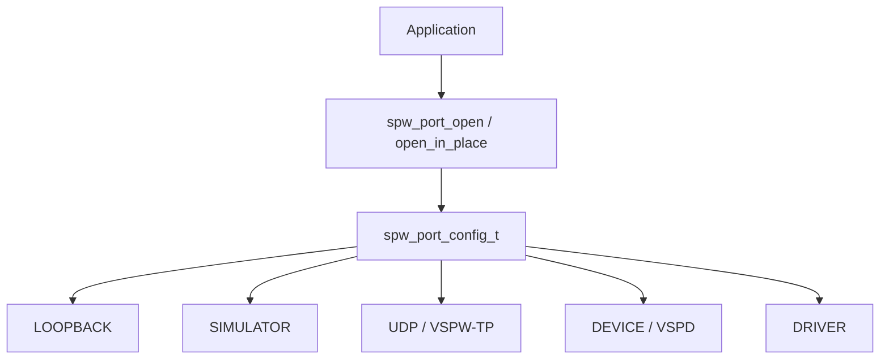

# Port and backend configuration

SpWKit applications select an implementation through `spw_port_config_t`. Normal packet/link operations remain on the common public API rather than calling simulator, socket, VSPD, CUSE, DMA or vendor interfaces directly.



## Common configuration

```c
struct spw_port_config {
    uint32_t struct_size;
    uint32_t version;
    spw_backend_id_t backend;
    uint32_t flags;
    const void* backend_config;
    size_t backend_config_size;
};
```

Use `SPW_PORT_CONFIG_INITIALIZER(...)` for deterministic defaults. `struct_size` and `version` form an explicit extension contract. Unknown versions, unsupported flags, or invalid backend-specific configuration are rejected.

Current backend IDs are:

```text
SPW_BACKEND_LOOPBACK
SPW_BACKEND_SIMULATOR
SPW_BACKEND_UDP
SPW_BACKEND_DEVICE
SPW_BACKEND_DRIVER
```

A backend identifier/configuration can remain source-visible even when its runtime is unavailable in a particular build; selecting it then returns `SPW_ERR_UNSUPPORTED`.

## Loopback

```c
spw_port_config_t config =
    SPW_PORT_CONFIG_INITIALIZER(SPW_BACKEND_LOOPBACK);
```

Loopback requires no backend-specific configuration.

## Process-local simulator

```c
spw_simulator_config_t simulator = SPW_SIMULATOR_CONFIG_INITIALIZER;
simulator.link_id = 42;
simulator.endpoint = SPW_SIMULATOR_ENDPOINT_A;

spw_port_config_t config =
    SPW_PORT_CONFIG_INITIALIZER(SPW_BACKEND_SIMULATOR);
config.backend_config = &simulator;
config.backend_config_size = sizeof(simulator);
```

Two peers use the same `link_id` and opposite A/B labels. Those labels exist only for deterministic pairing.

## Distributed UDP

```c
spw_udp_config_t udp = SPW_UDP_CONFIG_INITIALIZER(42000, 42001, 42);

spw_port_config_t config =
    SPW_PORT_CONFIG_INITIALIZER(SPW_BACKEND_UDP);
config.backend_config = &udp;
config.backend_config_size = sizeof(udp);
```

The opposite peer swaps local/remote ports and uses the same `link_id`. The initializer uses numeric localhost; another numeric IPv4 address can be copied into the bounded address fields.

Key configuration areas include:

- fragment payload size;
- ACK timeout and retry count;
- keepalive and peer timeout;
- effective virtual link bit rate and fixed latency;
- deterministic fault seed/rules.

The hosted runtime uses POSIX sockets on Unix-like hosts and native Winsock on Windows. Both use the same `spw_udp_config_t`, public API, and VSPW-TP wire contract.

### Cooperative progress

The UDP backend has no required hidden worker thread. Normal API calls service ACKs, retries, keepalive/liveness and virtual timing. An application that makes no SpWKit calls does not run those cooperative timers in the background.

## Linux DEVICE / VSPD

```c
spw_device_config_t device = SPW_DEVICE_CONFIG_INITIALIZER(0u);

spw_port_config_t config =
    SPW_PORT_CONFIG_INITIALIZER(SPW_BACKEND_DEVICE);
config.backend_config = &device;
config.backend_config_size = sizeof(device);
```

The default development endpoint is `/tmp/spwkit-vspwd.sock`. A bounded alternate socket path can be copied into `device.endpoint`.

The public configuration exposes only a virtual port ID and endpoint path. Unix descriptors, VSPD frames and poll structures remain private.

Build controls:

```text
SPWKIT_BUILD_DEVICE=ON
SPWKIT_BUILD_VSPWD=ON
SPWKIT_BUILD_TOOLS=ON
SPWKIT_BUILD_CUSE=ON
```

`SPWKIT_BUILD_CUSE` builds the separate `spwcuse` presenter. CUSE does not create a new `libspwkit` backend; it uses `SPW_BACKEND_DEVICE` underneath and exposes `/dev/vspwX` only as an optional Linux presentation.

## Portable driver backend

`SPW_BACKEND_DRIVER` is configured with `spw_driver_config_t` from `<spwkit/driver.h>`.

Conceptually:

```c
spw_driver_config_t driver = SPW_DRIVER_CONFIG_INITIALIZER;
driver.ops = &my_driver_ops;
driver.driver_context = &my_driver_context;

spw_port_config_t config =
    SPW_PORT_CONFIG_INITIALIZER(SPW_BACKEND_DRIVER);
config.backend_config = &driver;
config.backend_config_size = sizeof(driver);
```

Use the exact initializer/member names defined by the installed header for the selected SpWKit version; the driver structure is versioned so the callback contract can evolve explicitly.

The callback table/context remain caller-owned until `spw_port_close()` returns. A driver may represent a host reference model, MCU peripheral, RTOS device, vendor SDK or future FPGA/DMA controller.

Driver ABI v2 can supply an all-or-nothing DMA ownership callback set. SpWKit maps it to the ordinary public acquire/submit/reclaim/release buffer API and uses bounded wrapper slots from the port workspace.

Native register maps, DMA descriptor types and physical addresses are not application configuration fields.

## Allocation configuration

`SPWKIT_ENABLE_HEAP=ON` enables hosted `spw_port_open()`. With heap disabled, callers use:

```text
spw_port_workspace_requirements()
spw_port_open_in_place()
```

The optional C++17 wrapper forwards both operations through `spwkit::Port::workspace_requirements()` and `spwkit::Port::open_in_place()`.

## Backend isolation

Common application operations deliberately contain no:

- file descriptors or socket objects;
- CUSE/FUSE handles;
- DMA/physical addresses or descriptors;
- AXI/MMIO types;
- RTOS task/semaphore handles;
- vendor SDK handles.

Backend-specific configuration may expose portable descriptive values needed to select an implementation. Native mechanism types stay below the public SpaceWire-facing contract.
