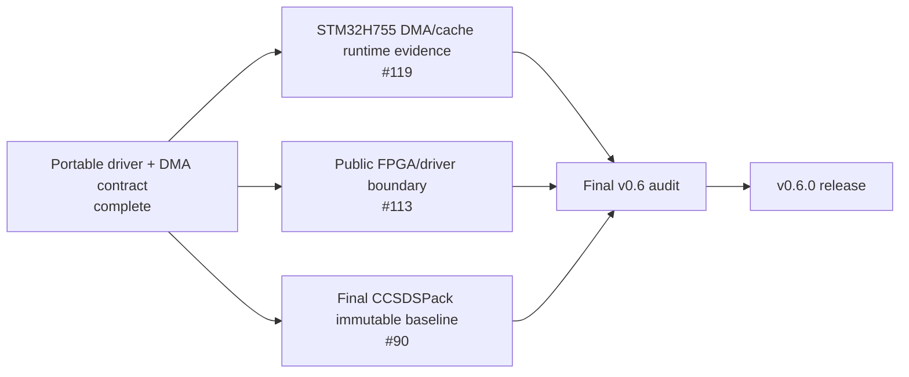

# Current project status

## Stable release: v0.5.0

`v0.5.0` is the current immutable stable release. It includes:

- process-local SpaceWire simulation;
- VSPW-TP/UDP on POSIX hosts and native Windows/Winsock;
- Linux `SPW_BACKEND_DEVICE`, VSPD and `vspwd`;
- `spwctl` and `spwmon`;
- production CUSE `/dev/vspwX` presentation;
- installed-package C and optional C++17 consumers;
- caller-owned/no-heap construction;
- zero-copy ownership semantics where advertised;
- HardRT `0.4.0` POSIX and Cortex-M7 integration evidence;
- multi-architecture Debian and GHCR publication.

## Development release: v0.6.0

`develop` carries the v0.6 integration work.

Completed software slices include:

- public `SPW_BACKEND_DRIVER` configuration/callback contract;
- DMA/zero-copy ownership mapping through the existing `spw_buffer_t` API;
- deterministic host reference-driver execution;
- no-heap/freestanding driver evidence;
- CCSDSPack PUS-C packet transport through installed-package UDP and Linux DEVICE/VSPD paths;
- two-node Docker Compose CCSDSPack-over-VSPW-TP/UDP integration;
- repository documentation reconciliation and C++ convenience-wrapper parity work.

The CCSDSPack dependency remains **provisional** against `CCSDSPack/develop` at a validated snapshot. Final v0.6 acceptance requires replacing that provisional reference with the user-approved immutable CCSDSPack 2.x release baseline and rerunning the integration evidence.

## Remaining v0.6 evidence

The STM32H755 runtime test is intentionally not considered complete until its exact board/test architecture is agreed and executed. Physical FPGA/SpaceWire electrical HIL remains outside the current software-only evidence.
