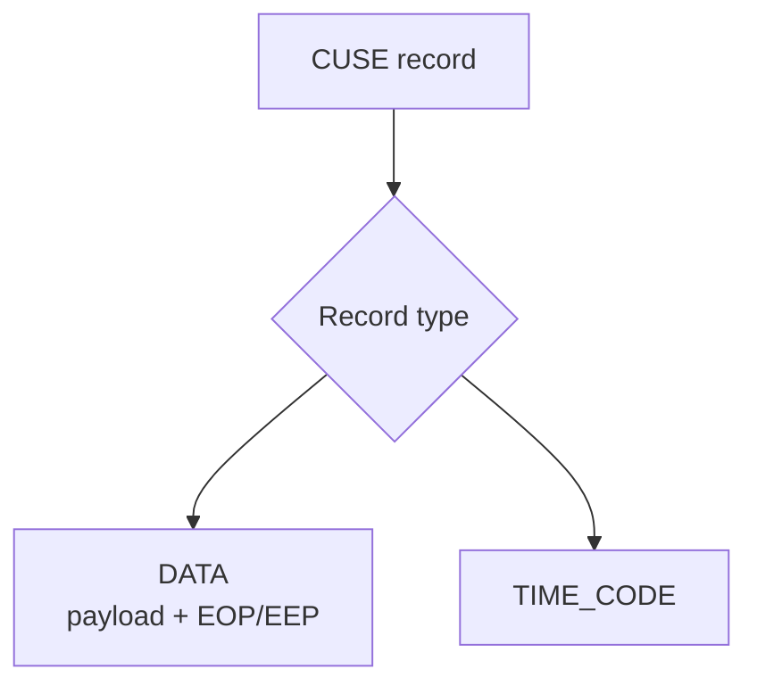
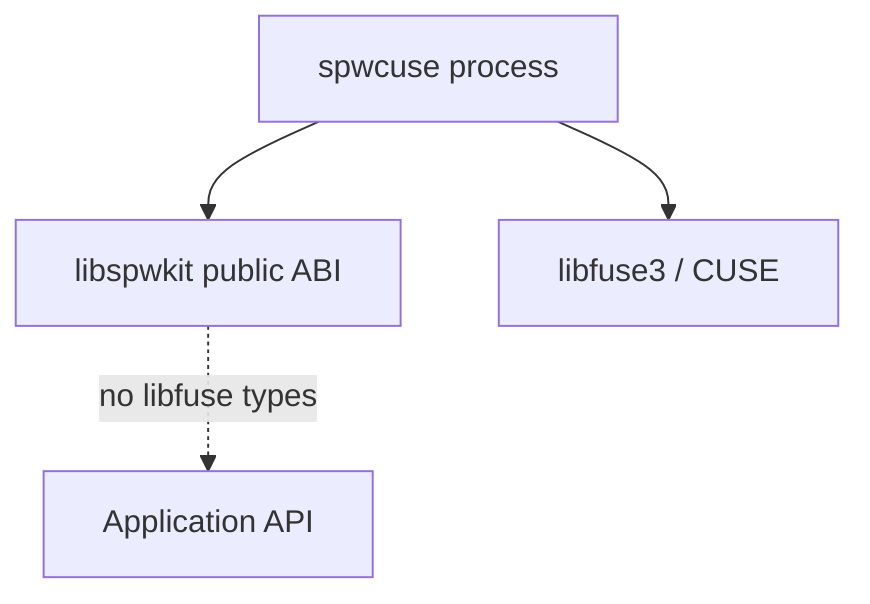

# Linux CUSE `/dev/vspwX` presenter

`spwcuse` is the optional Linux character-device presentation shipped in v0.5. It presents a `vspwd` virtual SpaceWire port as a real CUSE device while keeping libfuse/CUSE types outside `libspwkit`.

```mermaid
flowchart LR
    APP[Application using read/write/poll] --> NODE[/dev/vspw0]
    NODE --> CUSE[spwcuse]
    CUSE --> DEV[SPW_BACKEND_DEVICE]
    DEV --> VSPD[VSPD]
    VSPD --> D[vspwd]
    D --> PEER[paired virtual port / bridge]
```

`spwcuse` is a presenter, not a new SpaceWire runtime backend. It deliberately reuses the normal DEVICE/VSPD path so the daemon and public library do not gain a second data-plane implementation.

## Build

```bash
cmake -S . -B build-cuse \
  -DSPWKIT_BUILD_DEVICE=ON \
  -DSPWKIT_BUILD_VSPWD=ON \
  -DSPWKIT_BUILD_CUSE=ON
cmake --build build-cuse --parallel
```

`SPWKIT_BUILD_CUSE` is Linux-only and requires libfuse3. It does not make libfuse a dependency of `spwkit::spwkit`.

## Run

Start `vspwd`, then attach the presenter to an unowned daemon port:

```bash
./build-cuse/vspwd --socket /tmp/mission-vspwd.sock &
./build-cuse/spwcuse \
  --socket /tmp/mission-vspwd.sock \
  --port 0 \
  --device vspw0
```

The resulting device is typically `/dev/vspw0` when the host CUSE configuration permits that name.

A CUSE-presented port is subject to the same single-owner rule as a normal DEVICE/VSPD attachment. The presenter cannot steal a port already owned by another application.

## Record-oriented ABI

SpaceWire is packet/event oriented, so `/dev/vspwX` is **not** a UART-style byte stream. Each successful read/write operation handles one complete SpWKit CUSE record.



The record header uses fixed-width fields and does not expose native structure layout, pointers or daemon framing.

DATA records preserve:

- complete packet boundaries;
- payload bytes;
- EOP versus EEP;
- zero-length packets.

Time codes use a distinct record type rather than being encoded as DATA bytes.

## Read semantics

A read returns at most one complete record.

If the user buffer is smaller than the next complete record, `read()` fails with `EMSGSIZE` and **does not consume** the record. The application can retry with a larger buffer.

A non-blocking read with no available record returns `EAGAIN`/`EWOULDBLOCK`.

These rules mirror the public `spw_port_receive()` complete-packet/no-truncation contract rather than Unix stream semantics.

## Write semantics

A write must contain exactly one valid complete record. Invalid headers, impossible lengths, unknown record types or invalid terminator metadata are rejected.

DATA writes are translated into one public SpaceWire packet operation through the DEVICE backend. TIME_CODE writes use the corresponding public time-code operation.

## `poll()` / readiness

The presenter integrates CUSE poll notification with the public backend-neutral readiness API. Read readiness means a complete packet or time-code event can be returned without consuming it merely because `poll()` observed it.

## Isolation boundary



This separation allows CUSE to be omitted entirely from packages/targets that do not need device nodes.

## CI evidence

The v0.5+ CI matrix includes:

- pure-C CUSE presenter compilation;
- install-boundary checks;
- record codec tests;
- live `/dev/cuse` execution when the hosted runner exposes CUSE;
- DATA EOP/EEP and zero-length packets;
- time codes;
- `EMSGSIZE` non-consuming short reads;
- non-blocking `EAGAIN` behavior;
- `poll()` readiness;
- exclusive endpoint ownership.

The earlier [CUSE feasibility study](cuse-feasibility.md) is retained as a historical v0.4 design record; this document describes the production v0.5 implementation.

## Scope

CUSE proves a Linux character-device presentation for virtual SpaceWire behavior. It does not create a Linux network interface, emulate Data-Strobe/LVDS signals, or prove physical SpaceWire interoperability.
