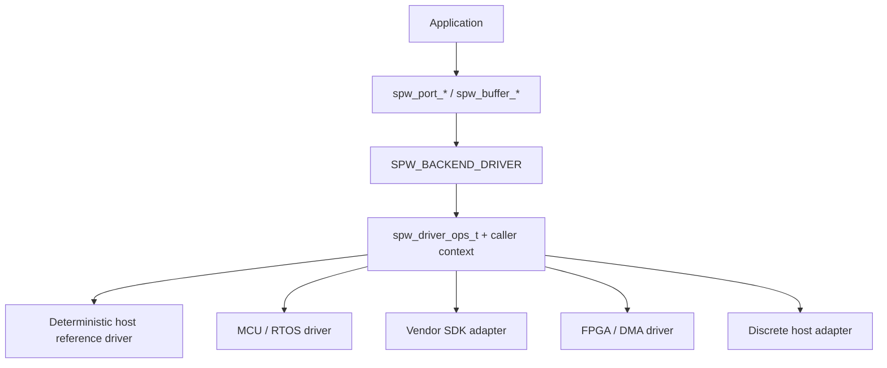
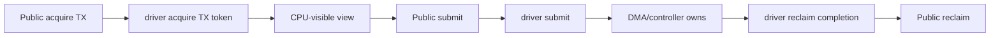

# Portable hardware-driver backend

`SPW_BACKEND_DRIVER` is the v0.6 software boundary between the ordinary SpWKit application API and a platform/vendor hardware driver.

The application still uses `spw_port_*` and `spw_buffer_*`; native controller details stay below the driver callback table.

## Public configuration

`<spwkit/driver.h>` defines the versioned driver configuration and callback contract. The callback table and driver context remain caller-owned for the lifetime of the SpWKit port.

The application-facing `spw_port_t` remains opaque. Driver callback/context pointers are backend-specific configuration, not generic packet/link types.

## Core callbacks

A driver maps controller behavior into the common operations, including lifecycle, observable link state, capabilities, copied DATA and optional time-code/statistics/readiness operations.

SpWKit validates required callbacks against the capabilities the driver advertises. A driver cannot claim a public optional capability and omit the callbacks needed to implement it.

## Provider model

`spw_driver_ops_t` is a semantic boundary, not a prescribed physical datapath.

A conforming provider may be implemented over:

- direct MMIO/PIO hardware;
- a streaming FPGA datapath with system/vendor DMA;
- an FPGA with integrated descriptor DMA;
- a vendor board that already exposes a SpaceWire SDK or kernel/device API;
- a bare-metal or RTOS controller driver;
- a discrete PCIe or similar host adapter;
- another implementation that can preserve the documented SpWKit packet/link semantics.

SpWKit does not require these providers to share a register map, bus, descriptor format, interrupt model, DMA engine, or internal software layering.

Applications therefore depend on the public SpaceWire contract rather than the controller implementation.

## Efficiency model

Portability must not require a lowest-common-denominator datapath.

Provider selection and capability validation happen when the driver-backed port is configured/opened. A provider is free to bind its efficient implementation once and use direct native operations on the hot path.

The public ABI does **not** require another per-packet runtime dispatch layer beneath `spw_driver_ops_t`.

### DMA-capable providers

When the provider can support stable buffer ownership, the DMA/zero-copy callback set is the intended fast path. An advertised zero-copy path must not hide payload copies behind the ownership API.

### Copied operations

Copied `send` and `receive` remain mandatory so all hardware can satisfy the common backend contract.

A DMA-capable provider may implement copied operations on top of the same native buffer/queue engine, requiring only the unavoidable copy between caller storage and the provider-owned buffer rather than maintaining a separate packet transport.

A PIO-only provider may implement copied I/O directly and simply omit the DMA/zero-copy capability.

### Vendor hardware

A vendor adapter should map to the most efficient native mechanism that the platform exposes. It does not need to emulate an unrelated FPGA hardware interface merely to use SpWKit.

If the vendor API exposes only copied packet transfer, copied operations are sufficient. If it exposes stable DMA/zero-copy ownership, the optional ownership callbacks can expose that capability through the same public API.

## DMA / zero-copy mapping

Driver ABI v2 can provide an all-or-nothing DMA ownership callback set.

The driver returns an opaque token plus CPU-visible pointer/capacity/alignment. SpWKit wraps that information in bounded opaque `spw_buffer_t` slots held inside the port workspace.

Native physical addresses, descriptor layouts and vendor handles never become public application fields.

### Cache synchronization

Optional driver cache callbacks can prepare a buffer for device access or CPU readback. Their implementation is platform-specific and may be a no-op on coherent systems.

The public contract intentionally says **when ownership changes**, not which cache-maintenance instruction or MPU/cache policy a platform must use.

## Receive atomicity

All provider types must preserve the common receive contract.

If the next complete packet is larger than the caller's copied receive capacity, the provider must return `SPW_ERR_BUFFER_TOO_SMALL`, report the required complete length and terminator, and leave that packet available for retry.

This can be implemented differently underneath the ABI:

- retain a complete packet in a FIFO/packet RAM;
- leave a completed DMA descriptor/buffer queued;
- retain a vendor-native packet object in adapter state;
- expose the complete packet directly through zero-copy acquisition.

The mechanism is private; the observable behavior is not.

## Error/result mapping

The driver maps native completion/errors into `spw_result_t`. Hardware-specific diagnostic detail may remain in the driver/vendor layer, but common application control flow must remain possible through portable result values and statistics.

## Reference-driver evidence

`tests/reference_driver` provides a deterministic host-side driver implementation that exercises the public driver backend and callback contract without claiming physical hardware.

The main v0.6 CI also covers:

- copied driver lifecycle/I/O;
- capability validation;
- zero-copy/DMA ownership transitions;
- cache-hook ordering;
- stale/foreign handle rejection;
- bounded wrapper resources;
- no-heap/freestanding compatibility.

## STM32H755 evidence boundary

The STM32H755 task is intended to validate the public driver/DMA boundary on real Cortex-M7 silicon, including actual memory-to-memory DMA and explicit cache/coherency handling. It is **not** yet counted as runtime evidence until the board/test architecture is agreed and executed.

The STM32 test is not a SpaceWire PHY test. It proves driver ownership/cache behavior relevant to a future controller integration.

## FPGA/public stop line

This public repository documents only the software obligations of a hardware driver. It does not publish or guess:

- proprietary RTL architecture;
- register/address maps;
- DMA descriptor layouts;
- internal bus topology;
- clock/reset/interrupt structure;
- specific IP-core selection.

A private, vendor, open-source, or otherwise independent FPGA/SpaceWire implementation can satisfy the same public driver contract while keeping its hardware design independent.
