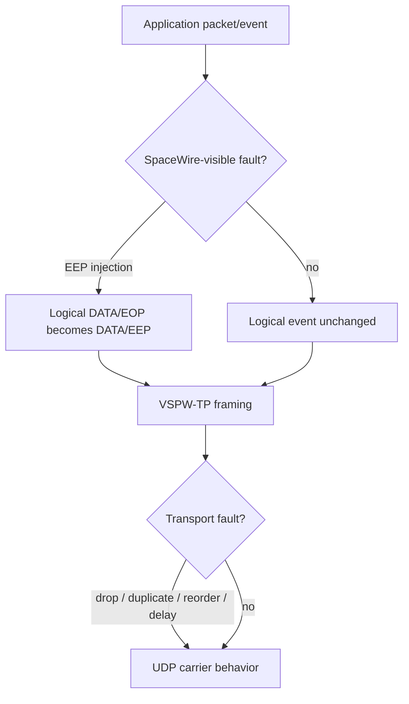

# Deterministic fault injection

SpWKit provides bounded deterministic fault injection in the distributed VSPW-TP/UDP backend. Two fault domains stay explicit: transport faults manipulate carrier datagrams, while SpaceWire-visible faults manipulate logical SpaceWire events.

## Configuration model

`spw_udp_config_t` contains a fixed array of fault rules plus a deterministic seed. Each enabled rule defines an action, target, probability, optional maximum firing count and, for delay actions, a delay.

Rules are evaluated in array order. Identical configuration plus identical event order reproduces the same decisions.

## Fault domains

A transport drop is not silently converted into SpaceWire EEP. Only an explicit SpaceWire-side rule changes the logical packet terminator.

## Transport fault domain

Transport actions can target DATA, TIME_CODE, ACK or KEEPALIVE/control datagrams:

- `SPW_UDP_FAULT_ACTION_TRANSPORT_DROP`;
- `SPW_UDP_FAULT_ACTION_TRANSPORT_DUPLICATE`;
- `SPW_UDP_FAULT_ACTION_TRANSPORT_REORDER`;
- `SPW_UDP_FAULT_ACTION_TRANSPORT_DELAY`.

The normal reliability layer remains responsible for retry and duplicate suppression. A dropped ACK can therefore trigger retransmission without causing the receiver to expose the logical packet twice.

## SpaceWire-visible domain

`SPW_UDP_FAULT_ACTION_SPACEWIRE_EEP` applies only to DATA and explicitly changes an outgoing EOP packet into an EEP packet before VSPW-TP framing. The receiver observes that EEP through the normal packet API.

## Diagnostics

Fault-capable backends advertise `SPW_CAP_FAULT_INJECTION`.

`spw_port_get_fault_statistics()` separates counters for transport drops/duplicates/reorders/delays from SpaceWire EEP injections. Clearing diagnostics does not rewrite the configured rule schedule; explicit port reset restarts deterministic injector state.

## Portability

Fault rule storage and reorder buffering are bounded. The deterministic decision engine is independent of the host socket API. Applying transport faults is implemented in the shared hosted UDP runtime and therefore works behind the same public semantics on POSIX and native Windows/Winsock paths.

No socket/native handle or fault-engine implementation type enters the common application ABI.

## Verification

Automated tests cover deterministic replay, rule validation, dropped-ACK recovery, duplicate suppression, arbitrary-order reassembly, transport-delay timeout behavior, explicit EEP injection and fault-domain statistics.

Fault injection is a software verification feature; it does not claim electrical/Data-Strobe fault fidelity.
