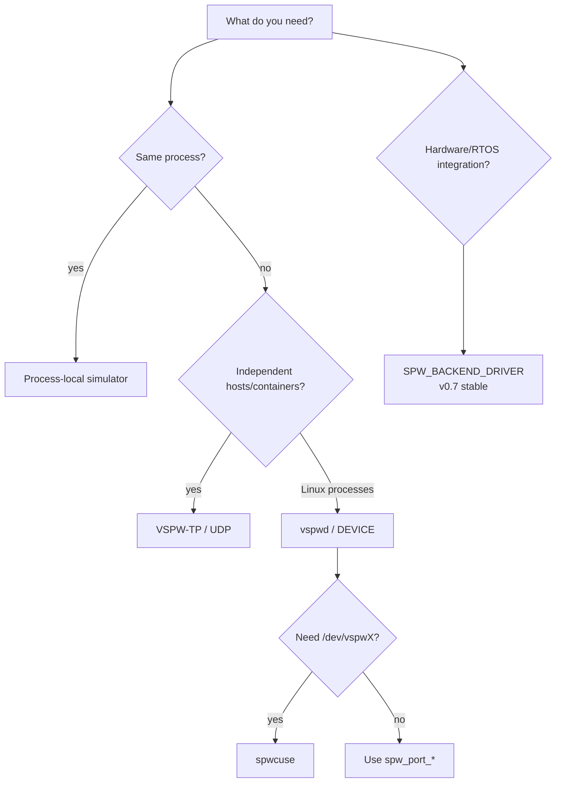
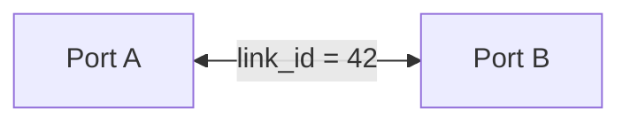
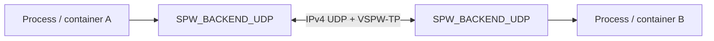

# Getting started

This guide targets the current stable `v0.7.0` release. v0.7.0 hardens the software-visible backend contract, behavioral equivalence, ECSS SpaceWire software-conformance traceability, and release-performance evidence before the planned v0.8 API/ABI cleanup phase.

## Choose how you want to run SpaceWire software



For ordinary application development, start with the copied packet API. Zero-copy is an optional capability that can be introduced later without changing packet semantics.

The v1-r1 [backend behavioral-equivalence matrix](backend-equivalence.md) makes this development path explicit: application packet/link logic validated against the simulator is exercised by the same shared contract against UDP, Linux DEVICE/VSPD and the deterministic DRIVER provider. Backend setup changes; the portable SpaceWire-facing API and documented semantics do not.

## Build from source

```bash
cmake -S . -B build \
  -DCMAKE_BUILD_TYPE=Release \
  -DSPWKIT_BUILD_TESTS=ON \
  -DSPWKIT_BUILD_EXAMPLES=ON
cmake --build build --parallel
ctest --test-dir build --output-on-failure
```

The runtime itself is C11. C++ is not required unless C++ examples/tests or the optional wrapper are enabled.

Enable the installed C++17 convenience target explicitly:

```bash
cmake -S . -B build-cpp \
  -DSPWKIT_ENABLE_CPP=ON \
  -DSPWKIT_BUILD_CPP_EXAMPLES=ON
cmake --build build-cpp --parallel
```

## Install the stable v0.7 package

`v0.7.0` publishes Debian revision `0.7.0-1` for:

```text
amd64
arm64
armhf
riscv64
```

Example package names:

```text
spwkit_0.7.0-1_amd64.deb
spwkit_0.7.0-1_arm64.deb
spwkit_0.7.0-1_armhf.deb
spwkit_0.7.0-1_riscv64.deb
```

Stable GHCR images are also published for `linux/amd64`, `linux/arm64`, `linux/arm/v7`, and `linux/riscv64`. See [binary packages](binary-packages.md).

## First C program

```c
#include <spwkit/spwkit.h>

#include <stdint.h>

int main(void) {
    spw_port_config_t config = SPW_PORT_CONFIG_INITIALIZER(SPW_BACKEND_LOOPBACK);
    spw_port_t* port = NULL;

    if (spw_port_open(&config, &port) != SPW_OK ||
        spw_port_start(port) != SPW_OK) {
        return 1;
    }

    uint8_t payload[] = {0x01, 0x02, 0x03};
    spw_packet_t packet = {
        .data = payload,
        .length = sizeof(payload),
        .capacity = sizeof(payload),
        .terminator = SPW_TERMINATOR_EOP,
    };

    const spw_result_t result =
        spw_port_send(port, &packet, SPW_TIMEOUT_IMMEDIATE);
    spw_port_close(port);
    return result == SPW_OK ? 0 : 2;
}
```

## First C++17 wrapper program

Build/install SpWKit with `SPWKIT_ENABLE_CPP=ON`, then link `spwkit::cpp`.

```cpp
#include <spwkit/spwkit.hpp>

#include <array>
#include <cstdint>

int main() {
    spw_port_config_t config = SPW_PORT_CONFIG_INITIALIZER(SPW_BACKEND_LOOPBACK);
    spwkit::Port port;

    if (spwkit::Port::open(config, port) != SPW_OK ||
        port.start() != SPW_OK) {
        return 1;
    }

    std::array<std::uint8_t, 3> payload{{0x01, 0x02, 0x03}};
    if (port.send(payload.data(), payload.size(), SPW_TERMINATOR_EOP) != SPW_OK) {
        return 2;
    }

    return port.stop() == SPW_OK ? 0 : 3;
}
```

The C++ wrapper also forwards workspace/no-heap construction, readiness, time codes, statistics and zero-copy ownership. It does not replace or reinterpret the C API.

## Use the process-local simulator

Two ports with the same `link_id` and opposite endpoint labels form a virtual link:

```c
spw_simulator_config_t a = SPW_SIMULATOR_CONFIG_INITIALIZER;
a.link_id = 42;
a.endpoint = SPW_SIMULATOR_ENDPOINT_A;

spw_simulator_config_t b = SPW_SIMULATOR_CONFIG_INITIALIZER;
b.link_id = 42;
b.endpoint = SPW_SIMULATOR_ENDPOINT_B;
```



Both endpoints are equal peers. Start both before expecting `SPW_LINK_RUN`.

The simulator is the recommended first backend for application packet/link development because it is deterministic and requires no daemon, network namespace or hardware. The v1-r1 equivalence proof runs the same `run_backend_contract()` application scenario against SIMULATOR, UDP, DEVICE/VSPD and DRIVER/reference. This does **not** imply equal timing or throughput; it means portable packet boundaries, EOP/EEP, errors, timeouts, lifecycle and capability-gated behavior remain coherent when the backend changes.

For a complete hosted Linux source build, the aggregate proof is:

```bash
ctest --test-dir build-hosted \
  -R '^backend_equivalence_v1_matrix$' \
  --output-on-failure
```

## Use zero-copy ownership

Check `SPW_CAP_ZERO_COPY` first. Supporting backends use this lifecycle:


The simulator provides a deterministic software implementation of this ownership contract. The v0.7 driver backend maps the same API onto driver/DMA buffers and enforces reset-safe ownership epochs.

## Run distributed virtual SpaceWire

Create two `SPW_BACKEND_UDP` ports with reversed local/remote UDP ports and a shared `link_id`. VSPW-TP handles packet fragmentation/reassembly, EOP/EEP, time codes, liveness and reliable logical-message behavior.



POSIX hosts and Windows/Winsock use the same public configuration and wire contract.

Standalone installed-package peers live in `examples/distributed` and `examples/distributed_cpp`. The CI suite also runs Linux network namespaces and Docker Compose isolation.

## Run Linux virtual devices

Build the daemon/backend:

```bash
cmake -S . -B build-device \
  -DSPWKIT_BUILD_DEVICE=ON \
  -DSPWKIT_BUILD_VSPWD=ON \
  -DSPWKIT_BUILD_TOOLS=ON
cmake --build build-device --parallel
```

Start the daemon:

```bash
./build-device/vspwd --socket /tmp/mission-vspwd.sock
```

Applications attach through `SPW_BACKEND_DEVICE`. `spwctl` inspects/manages daemon state and `spwmon` passively subscribes to snapshots.

### Optional `/dev/vspwX`

The stable v0.7 line includes `spwcuse` for applications that need a real Linux character device:

```bash
cmake -S . -B build-cuse \
  -DSPWKIT_BUILD_DEVICE=ON \
  -DSPWKIT_BUILD_VSPWD=ON \
  -DSPWKIT_BUILD_CUSE=ON
cmake --build build-cuse --parallel

./build-cuse/vspwd --socket /tmp/mission-vspwd.sock &
./build-cuse/spwcuse --socket /tmp/mission-vspwd.sock --port 0 --device vspw0
```

`/dev/vspw0` is record-oriented, not a raw byte stream. DATA packet boundaries, EOP/EEP and time codes remain explicit.

## No-heap / embedded construction

```c
spw_port_workspace_requirements_t req;
spw_port_workspace_requirements(&config, &req);

/* Storage must satisfy req.size and req.alignment. */
spw_port_t* port = NULL;
spw_port_open_in_place(&config, workspace, workspace_size, &port);
```

With `SPWKIT_ENABLE_HEAP=OFF`, `spw_port_open()` is not the construction path; use caller-owned storage.

HardRT `0.4.0` is the currently validated external RTOS baseline. The Cortex-M7 CI fixture is compile/link evidence; a separate physical NUCLEO-H755ZI-Q qualification has also completed using real DMA2 and explicit Cortex-M7 cache synchronization through the public driver boundary. Neither result is physical SpaceWire PHY/electrical HIL.

## v0.7 driver backend

Stable `v0.7.0` includes `SPW_BACKEND_DRIVER`, its DMA/ownership callback boundary, and the reusable public backend-contract evidence. It is intended for host reference drivers, MCU/RTOS integrations and future FPGA/vendor controllers while keeping application source on the same `spw_port_*`/`spw_buffer_*` API.

The physical STM32H755 DMA/cache qualification validates the software ownership/cache boundary on real Cortex-M7 silicon. It does not prove a physical SpaceWire controller, codec, PHY or cable; FPGA/SpaceWire HIL remains a separate future evidence layer.

## Consume the installed package

C:

```cmake
find_package(SpWKit 0.7 CONFIG REQUIRED)
target_link_libraries(my_app PRIVATE spwkit::spwkit)
```

C++17 wrapper:

```cmake
find_package(SpWKit 0.7 CONFIG REQUIRED)
target_link_libraries(my_app PRIVATE spwkit::cpp)
```

The stable v0.7 package examples request the compatible `0.7` line. `v0.7.0` is the immutable release evidence boundary for this package line.
