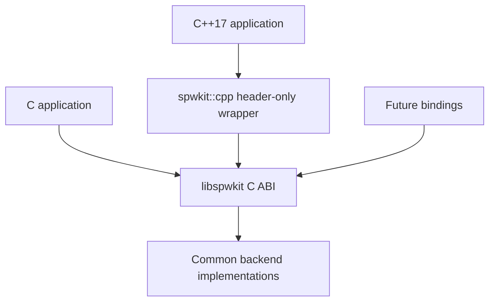

# Language bindings and C++17 wrapper

SpWKit has one authoritative runtime ABI: C11. Other language surfaces must delegate to that ABI rather than implement independent backend behavior.



## C11

The installed C API under `<spwkit/*.h>` is the portability and binary-compatibility baseline. It contains only C-compatible fixed/public types and opaque handles.

`spwkit::spwkit` is the exported CMake target.

## Optional C++17 wrapper

When SpWKit is configured with `SPWKIT_ENABLE_CPP=ON`, the package installs `<spwkit/spwkit.hpp>` and exports `spwkit::cpp`.

The wrapper is:

- header-only;
- C++17;
- move-only/RAII for ports;
- result-code based;
- exception-free and RTTI-independent;
- a thin forwarding layer over the C API.

It adds no backend logic and no alternate ABI.

### Current parity

`spwkit::Port` forwards the application-facing port operations that make sense as C++ methods:

| Area | C API | C++17 wrapper |
|---|---|---|
| workspace requirements | `spw_port_workspace_requirements` | `Port::workspace_requirements` |
| hosted open | `spw_port_open` | `Port::open` |
| caller-owned open | `spw_port_open_in_place` | `Port::open_in_place` |
| lifecycle | start/stop/reset/close | member methods / RAII close |
| link state/capabilities | getters | member methods |
| readiness | `spw_port_wait` | `Port::wait` |
| copied DATA | send/receive | member methods |
| time codes | send/receive | member methods |
| statistics | query/clear | member methods |
| fault statistics | query/clear | member methods |
| TX zero-copy | acquire/submit/reclaim/release | member methods |
| RX zero-copy | acquire/release | member methods |
| buffer view | `spw_buffer_get_view` | `Port::buffer_view` |
| TX packet metadata | `spw_buffer_set_packet` | `Port::set_packet` |

The wrapper aliases the underlying opaque/value types as `spwkit::Buffer`, `spwkit::BufferView`, and `spwkit::WorkspaceRequirements`. Ownership behavior remains exactly the C behavior, including pointer clearing on successful submit/release.

### Example

```cpp
#include <spwkit/spwkit.hpp>

#include <array>
#include <cstdint>

spw_port_config_t config = SPW_PORT_CONFIG_INITIALIZER(SPW_BACKEND_LOOPBACK);
spwkit::Port port;

if (spwkit::Port::open(config, port) != SPW_OK || port.start() != SPW_OK) {
    return 1;
}

std::array<std::uint8_t, 4> payload{{0x53, 0x70, 0x57, 0x4b}};
if (port.send(payload.data(), payload.size(), SPW_TERMINATOR_EOP) != SPW_OK) {
    return 2;
}
```

### Zero-copy example shape

```cpp
spwkit::Buffer* tx = nullptr;
if (port.acquire_tx_buffer(256, tx) == SPW_OK) {
    spwkit::BufferView view{};
    if (spwkit::Port::buffer_view(*tx, view) == SPW_OK) {
        /* fill view.data */
        spwkit::Port::set_packet(*tx, 128, SPW_TERMINATOR_EOP);
        port.submit_tx_buffer(tx);
    }
}
```

The executable `examples/cpp_wrapper_simulator_zero_copy.cpp` exercises the full successful acquire/fill/submit/RX/release/reclaim sequence against the simulator.

## Build/package behavior

The C runtime never requires C++ merely because tests/examples are enabled. CMake keeps independent controls:

```text
SPWKIT_BUILD_TESTS
SPWKIT_BUILD_CPP_TESTS
SPWKIT_BUILD_EXAMPLES
SPWKIT_BUILD_CPP_EXAMPLES
SPWKIT_ENABLE_CPP
```

A pure-C consumer can use `CXX=/bin/false`. The optional wrapper target is installed only when explicitly enabled.

C consumer:

```cmake
find_package(SpWKit 0.5 CONFIG REQUIRED)
target_link_libraries(app PRIVATE spwkit::spwkit)
```

C++ wrapper consumer:

```cmake
find_package(SpWKit 0.5 CONFIG REQUIRED)
target_link_libraries(app PRIVATE spwkit::cpp)
```

## Platform/backend behavior

The wrapper does not create platform-specific behavior. `SPW_BACKEND_UDP` uses POSIX sockets or Winsock beneath the same C API; `SPW_BACKEND_DEVICE` remains Linux-specific; v0.6 `SPW_BACKEND_DRIVER` is portable to hosted and embedded targets according to the selected driver implementation.

A wrapper method may therefore return `SPW_ERR_UNSUPPORTED` for a capability or backend that is unavailable in the selected build, exactly as the C call would.

## Future language bindings

A future Rust/Python/etc. binding should bind the C ABI and preserve:

- opaque handle lifetime;
- explicit result codes;
- exact timeout semantics;
- complete packet/EOP/EEP behavior;
- capability gating;
- zero-copy ownership transitions;
- no exposure of transport/native backend types through the common surface.

Bindings must not reinterpret UDP datagrams, VSPD records, CUSE records, or DMA descriptors as the application SpaceWire contract.
