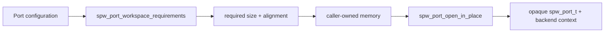
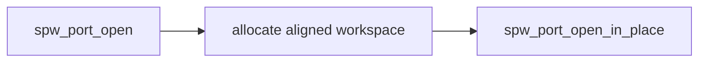
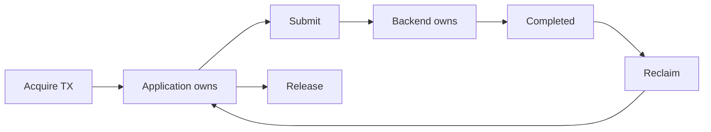
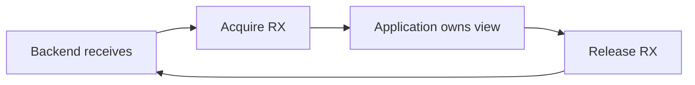

# Memory model and no-heap operation

SpWKit separates the public port/packet contract from the mechanism used to store the opaque port and backend implementation.

The portable path does **not** require dynamic allocation.

## Caller-owned workspace



```c
spw_port_config_t config = SPW_PORT_CONFIG_INITIALIZER(SPW_BACKEND_LOOPBACK);
spw_port_workspace_requirements_t req;
spw_port_workspace_requirements(&config, &req);

/* Example only. Real code must satisfy req.size and req.alignment. */
static unsigned char workspace[64 * 1024];

spw_port_t* port = NULL;
spw_port_open_in_place(&config, workspace, sizeof(workspace), &port);
```

Backend object size is deliberately not a public ABI constant. Different backends may require different storage and future versions can change private implementation size without exposing it as an application structure.

Workspace may come from static/global storage, an RTOS pool, a linker-defined section, stack storage when appropriate, or another application-managed region. SpWKit does not require a particular allocator.

## Hosted convenience allocation

`spw_port_open()` is a convenience wrapper around the same construction model when `SPWKIT_ENABLE_HEAP=ON`.



With `SPWKIT_ENABLE_HEAP=OFF`, the hosted allocation path returns `SPW_ERR_UNSUPPORTED`; the caller-owned path remains available.

The optional C++ wrapper exposes the same distinction through `Port::workspace_requirements()`, `Port::open()` and `Port::open_in_place()`.

## Copied packet memory

For copied I/O:

- TX payload memory remains caller-owned for the duration of `spw_port_send()`;
- RX memory is supplied by the caller to `spw_port_receive()`;
- a backend never silently truncates a complete packet;
- `SPW_ERR_BUFFER_TOO_SMALL` reports the required complete length/terminator and leaves the packet pending.

Local and distributed backends may maintain bounded internal queues/reassembly storage. Those implementation buffers are not application-owned `spw_packet_t` storage.

## Zero-copy ownership

The zero-copy API is capability-gated by `SPW_CAP_ZERO_COPY` and models **ownership**, not a particular DMA representation.





Public buffer views do not expose physical addresses, DMA descriptors, file descriptors, AXI objects or vendor handles.

The process-local simulator implements the ownership contract using fixed aligned host memory. The v0.6 driver backend maps the same lifecycle onto driver-owned/DMA-capable buffers through `spw_driver_ops_t`, including optional cache synchronization callbacks. Physical hardware details stay below the driver boundary.

## Driver workspace

The v0.6 driver backend keeps bounded SpWKit wrapper slots inside the normal port workspace. This allows DMA ownership bookkeeping without introducing mandatory heap allocation. The vendor/MCU driver remains responsible for its own hardware memory and descriptor lifecycle.

## Hosted versus embedded resources

The simulator and UDP backends are hosted software/runtime paths and may use host synchronization or socket facilities internally. The Linux DEVICE backend similarly uses private Unix IPC. Those dependencies disappear from profiles where the corresponding backends are disabled.

The freestanding/embedded portability baseline disables hosted backends and uses caller-owned construction. HardRT Cortex-M7 CI additionally demonstrates complete no-heap compile/link integration with hosted transports disabled.

## CI verification

Current CI includes:

- pure-C static/shared package consumers;
- explicit no-heap `spw_port_open_in_place()` behavior;
- C++ wrapper/no-heap compilation without exceptions/RTTI;
- freestanding C archive checks;
- Cortex-M7/HardRT compile-link evidence;
- v0.6 driver and DMA ownership tests with bounded wrapper storage.

These are software memory/portability claims. They do not prove cache coherency on a specific MCU or FPGA. STM32H755 DMA/cache behavior remains a separate runtime evidence item.
