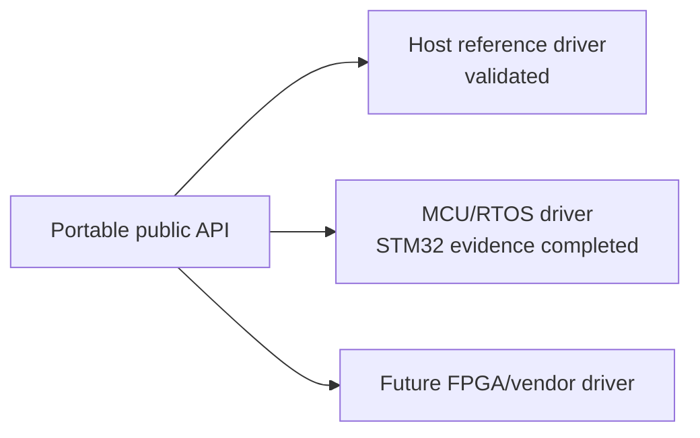

# Platform support

Platform support is split into **source/API visibility**, **runtime implementation**, and **verification evidence**. A public backend ID/configuration may be installed on a platform even when selecting that backend returns `SPW_ERR_UNSUPPORTED`.

## Stable v0.6 hosted matrix

| Capability | Linux | macOS | Windows |
|---|---:|---:|---:|
| C11 runtime / loopback | yes | yes | yes |
| process-local simulator | yes | yes | yes |
| VSPW-TP / UDP | POSIX | POSIX | native Winsock |
| Linux DEVICE / VSPD | yes | no | no |
| `vspwd` / tools | yes | no | no |
| CUSE `/dev/vspwX` | yes | no | no |
| portable DRIVER API | yes | yes | yes |
| optional C++17 wrapper | yes | yes | yes |

The public UDP configuration/wire contract is identical across POSIX and Windows. Winsock types remain private.

## Stable v0.6 architecture packages

Release `v0.6.1` publishes Debian packages for:

```text
amd64
arm64
armhf
riscv64
```

The matching GHCR image supports:

```text
linux/amd64
linux/arm64
linux/arm/v7
linux/riscv64
```

Cross/QEMU package execution is architecture evidence, not physical target/HIL evidence.

## Embedded / RTOS evidence

HardRT release `0.4.0` is the current validated external RTOS integration baseline.

- HardRT POSIX integration executes two task-owned SpWKit ports against installed packages.
- Cortex-M7/ARMv7E-M integration cross-builds and links no-heap SpWKit with the HardRT Cortex-M port.
- That Cortex-M7 CI job is compile/link/ABI evidence.
- Separate physical NUCLEO-H755ZI-Q qualification executes real DMA2 and explicit Cortex-M7 cache synchronization through the public DRIVER boundary.

The physical STM32 result is MCU driver/DMA/cache evidence, not SpaceWire controller/PHY/electrical evidence.

## v0.6 portable driver backend

Stable `v0.6.1` includes `SPW_BACKEND_DRIVER`, driver ABI v2 DMA/zero-copy ownership mapping and a deterministic host reference driver.



The driver contract itself is portable. Runtime support depends entirely on the driver implementation supplied by the consuming platform.

NUCLEO-H755ZI-Q DMA/cache runtime qualification has completed successfully. Future physical FPGA/SpaceWire support remains outside current runtime claims.

## Build profiles

Common build profiles include:

- full hosted C runtime;
- optional C++17 wrapper/tests/examples;
- C-only static/shared runtime with `CXX=/bin/false`;
- no-heap/freestanding core;
- Linux virtual-device/service/tools/CUSE profile;
- driver/reference-driver profile;
- Cortex-M7/HardRT cross profile;
- separate physical STM32H755 DMA/cache evidence firmware.

## Unsupported behavior

Portable applications should not infer backend availability solely from the host OS or from a header enum. Query package metadata where appropriate, inspect capabilities after open, and handle `SPW_ERR_UNSUPPORTED` for optional/disabled paths.

## HIL boundary

Physical SpaceWire hardware, Data-Strobe/LVDS interoperability and board/controller-specific timing require dedicated HIL/electrical evidence. Hosted simulation, Docker, CUSE, QEMU or STM32 memory-to-memory DMA do not substitute for that evidence.
