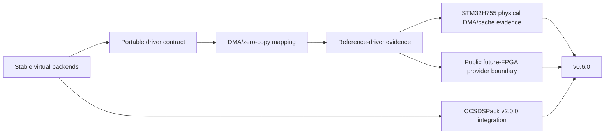

# Roadmap

The roadmap is organized around evidence boundaries rather than aspirational backend names. Stable tags remain immutable; `develop` is the integration branch for subsequent work.

## Released milestones

### v0.1

Established the portable SpaceWire-facing C API, deterministic loopback/process-local simulation, bounded resource behavior, EOP/EEP, time codes, caller-owned construction and zero-copy ownership semantics.

### v0.2

Added distributed VSPW-TP/UDP, fragmentation/reassembly, session/liveness, retry/deduplication, virtual timing, deterministic transport/SpaceWire fault injection and capture tooling.

### v0.3

Expanded package/consumer and portability evidence while keeping the application API transport-neutral and moving the runtime to an authoritative C11 implementation.

### v0.4

Delivered the Linux virtual-device/service boundary:

- `SPW_BACKEND_DEVICE`;
- VSPD;
- `vspwd`;
- `spwctl`;
- `spwmon`;
- installed C/C++ device consumers;
- VSPW-TP bridge integration.

### v0.5

Completed hosted-platform parity and embedded/RTOS integration evidence:

- native Windows/Winsock VSPW-TP/UDP;
- production CUSE `/dev/vspwX` presentation;
- HardRT POSIX execution integration;
- Cortex-M7/HardRT compile-link integration;
- multi-architecture Debian publication (`amd64`, `arm64`, `armhf`, `riscv64`);
- multi-platform GHCR publication;
- v0.5.1 maintenance parity for the optional C++17 wrapper.

### v0.6.0

Completed the public hardware-driver integration boundary without publishing proprietary hardware implementation details.

Delivered evidence includes:

- public `SPW_BACKEND_DRIVER` configuration/callback contract;
- driver ABI v2 DMA/zero-copy ownership mapping;
- bounded wrapper slots and no-heap compatibility;
- deterministic host reference driver;
- driver/DMA contract and cache-hook tests;
- immutable CCSDSPack `v2.0.0` baseline at `c2f318c330c564429bcc565a8acbff22728b2851`;
- installed-package CCSDSPack PUS-C interoperability over UDP and Linux DEVICE/VSPD;
- two-node Docker Compose CCSDSPack-over-VSPW-TP/UDP exchange;
- proprietary-safe future FPGA/provider boundary documentation and generic HIL acceptance criteria;
- physical NUCLEO-H755ZI-Q validation with real DMA2, Cortex-M7 cache synchronization and reset-time stale-buffer invalidation.

The STM32 qualification is real MCU DMA/cache/zero-copy evidence. It is not SpaceWire electrical or PHY interoperability evidence.

### v0.6.1

Consolidated the v0.6 contract as a patch release without an intentional public API/ABI break:

- finalized profiling backend discovery plus host/build/counter metadata;
- retained the accepted VSPW-TP reassembly optimization, including the controlled 4096-byte RX paired-overhead reduction from 60,281 to 25,032 invariant-TSC ticks;
- reduced avoidable readiness overhead in POSIX UDP and Linux DEVICE/VSPD while preserving timeout/error semantics;
- synchronized package, testing, profiling and hardware-evidence documentation;
- published immutable `v0.6.1` source, multi-architecture Debian packages and the multi-architecture GHCR image through the release-policy workflow.

### v0.7.0

Hardened the software-visible behavioral/backend contract before the planned v0.8 API/ABI cleanup phase:

- the deterministic DRIVER/reference provider executes the reusable public backend contract (#211);
- threading, lifecycle, error, timeout, resource and zero-copy reset/ownership semantics are defined and enforced (#212);
- simulator-to-backend behavioral equivalence is versioned and executable across SIMULATOR, VSPW-TP/UDP, Linux DEVICE/VSPD and DRIVER (#214);
- ECSS-E-ST-50-12C Rev.1 has a project-owned `v0.7-r2` applicability/traceability matrix with specifically enumerated positive software claims and explicit delegated/future/not-applicable dispositions;
- concrete controller/PHY/electrical and complete node time-code-engine requirements are delegated explicitly to the provider, with `spwkit-fpga` responsible for its applicable hardware-side evidence;
- release-performance tooling compares immutable `v0.6.1` with the candidate using matched public-operation/native-relative metrics and separate lifecycle evidence;
- repeated hosted and same-runner campaigns distinguish reproducible regressions from counter/scheduler noise;
- avoidable LOOPBACK duplicate validation was removed before release, while the reset-safe zero-copy ownership guard was retained after its real cost was isolated at approximately two architectural counter ticks per acquire+release pair.

A performance regression is accepted only when it is a necessary correctness/semantic tradeoff, quantified and documented. Known avoidable release-candidate cleanup is not intentionally deferred to a patch release merely because a patch number is available.

Release tagging remains governed by the exact-candidate evidence gate in #224 and the repository release-policy workflow. See [`ecss-conformance.md`](ecss-conformance.md) for the software/provider conformance boundary and [`../benchmarks/v0.7.0-performance-evidence.md`](../benchmarks/v0.7.0-performance-evidence.md) for the performance acceptance record.

## v0.8.x contract and ECSS architecture phase

v0.8 is the last planned phase in which intentional public API/ABI cleanup may be introduced before the v0.9 freeze. It is therefore also the correct point to resolve standards work that could alter interfaces, lifecycle behavior, configuration structures or the provider contract.

Planned standards work:

- perform a project-wide **ECSS-E-ST-40** applicability audit for the SpWKit software lifecycle, requirements, architecture, interfaces, verification, configuration/change management and release evidence;
- convert applicable E-ST-40 findings into explicit requirement-to-design-to-test traceability rather than treating process documentation as an informal side note;
- identify and implement any E-ST-40-driven API/architecture corrections while breaking changes are still permitted;
- begin an **ECSS-Q-ST-80** applicability audit and identify product-assurance, verification, static-analysis, robustness and configuration-control gaps that must be closed before v1.0;
- keep ECSS-E-ST-50-12C Rev.1 software conformance requirement-based and update the matrix as the software surface evolves.

The currently deferred ECSS-E-ST-50-12C Rev.1 software capabilities are evaluated here before the API freezes:

- **distributed interrupts** (`5.6.5`, `6.1.3`): evaluate the public capability/type/API model and implement if it belongs in the stable endpoint contract;
- **standardized node-management parameters** (`5.6.7`): determine which parameters belong in a generic endpoint library and implement only the applicable subset rather than manufacturing an unrelated management framework to make a compliance table greener;
- **SpaceWire MIB/service** (`5.7`, `6.5`): assess product relevance and required software surface. It may remain explicitly unsupported or move beyond v1.0 if it does not belong in the core endpoint/link toolkit.

Routing and routing-switch management remain outside the core SpWKit product scope unless that scope is deliberately changed by a future architectural decision.

## v0.9.x API freeze and assurance phase

v0.9 is the v1.0 release-candidate line. By entry to this phase, any ECSS requirement capable of forcing public API or architecture changes should already have been resolved in v0.8.

Planned work:

- freeze the public C API/ABI and exported-symbol contract;
- activate source/ABI/export regression gates;
- complete the applicable **ECSS-E-ST-40** software-engineering evidence set;
- close the applicable **ECSS-Q-ST-80** software product-assurance gaps identified during v0.8;
- complete robustness evidence including fuzzing, soak/stress campaigns and malformed-input/resource-exhaustion behavior;
- retain requirements-to-design-to-test traceability and reproducible release evidence for all claimed standards-visible behavior;
- verify configuration/change-control, anomaly handling and release reproducibility expectations appropriate to a stable infrastructure library;
- run final performance-regression campaigns against the previous immutable release before each release candidate is accepted.

This phase hardens and proves the contract; it should not be discovering fundamental interface obligations for the first time.

## v1.0.0 stable software contract

v1.0 is the first stable 1.x software contract. It targets:

- stable authoritative C11 API/ABI and backend/DRIVER contract;
- deterministic simulator and cross-backend behavioral-equivalence evidence;
- documented threading, timeout, error, resource and zero-copy ownership guarantees;
- positive, evidence-backed conformance for the specifically enumerated software-applicable requirements of **ECSS-E-ST-50-12C Rev.1**;
- documented applicability/compliance status and retained evidence for applicable **ECSS-E-ST-40** software-engineering requirements;
- documented applicability/compliance status and retained evidence for applicable **ECSS-Q-ST-80** software product-assurance requirements;
- an explicit provider boundary for physical/controller/PHY/electrical requirements, including the `spwkit-fpga` implementation where applicable.

Full physical SpaceWire conformance for a concrete system remains a composition of SpWKit software evidence plus the corresponding physical-provider/system evidence.

## Post-v1 / physical and optional directions

Later work may include:

- a real FPGA/vendor SpaceWire driver implementation below the existing public driver contract;
- physical SpaceWire HIL and electrical interoperability evidence;
- physical host adapters, including a future USB-to-SpaceWire hardware path;
- additional RTOS/platform adapters;
- upper-layer protocols such as RMAP kept modular above the link API;
- SpaceWire MIB/service support if the v0.8 product-scope review concludes it belongs in SpWKit;
- longer-term ASIC-backed physical interface work where justified by cost and qualification needs.

SpWKit remains focused on endpoint/link communication rather than becoming a router implementation. Networks containing SpaceWire routers can still be reached through routing information handled above or below the link boundary, but generic router implementation is not a core SpWKit deliverable.

No later milestone is considered delivered merely because an interface placeholder or documentation concept exists.
