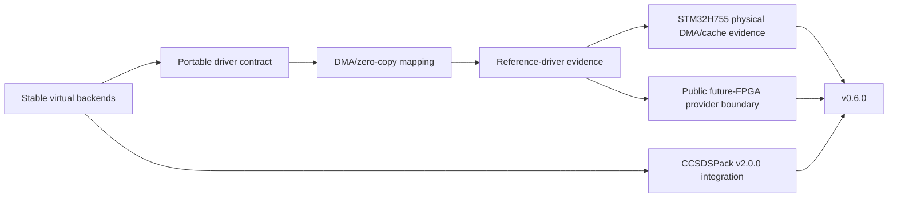

# Roadmap

The roadmap is organized around evidence boundaries rather than aspirational backend names. Stable tags remain immutable; `develop` is the integration branch for subsequent work.

## Released milestones

### v0.1

Established the portable SpaceWire-facing C API, deterministic loopback/process-local simulation, bounded resource behavior, EOP/EEP, time codes, caller-owned construction and zero-copy ownership semantics.

### v0.2

Added distributed VSPW-TP/UDP, fragmentation/reassembly, session/liveness, retry/deduplication, virtual timing, deterministic transport/SpaceWire fault injection and capture tooling.

### v0.3

Expanded package/consumer and portability evidence while keeping the application API transport-neutral and moving the runtime to an authoritative C11 implementation.

### v0.4

Delivered the Linux virtual-device/service boundary:

- `SPW_BACKEND_DEVICE`;
- VSPD;
- `vspwd`;
- `spwctl`;
- `spwmon`;
- installed C/C++ device consumers;
- VSPW-TP bridge integration.

### v0.5

Completed hosted-platform parity and embedded/RTOS integration evidence:

- native Windows/Winsock VSPW-TP/UDP;
- production CUSE `/dev/vspwX` presentation;
- HardRT POSIX execution integration;
- Cortex-M7/HardRT compile-link integration;
- multi-architecture Debian publication (`amd64`, `arm64`, `armhf`, `riscv64`);
- multi-platform GHCR publication;
- v0.5.1 maintenance parity for the optional C++17 wrapper.

### v0.6.0

Completed the public hardware-driver integration boundary without publishing proprietary hardware implementation details.

Delivered evidence includes:

- public `SPW_BACKEND_DRIVER` configuration/callback contract;
- driver ABI v2 DMA/zero-copy ownership mapping;
- bounded wrapper slots and no-heap compatibility;
- deterministic host reference driver;
- driver/DMA contract and cache-hook tests;
- immutable CCSDSPack `v2.0.0` baseline at `c2f318c330c564429bcc565a8acbff22728b2851`;
- installed-package CCSDSPack PUS-C interoperability over UDP and Linux DEVICE/VSPD;
- two-node Docker Compose CCSDSPack-over-VSPW-TP/UDP exchange;
- proprietary-safe future FPGA/provider boundary documentation and generic HIL acceptance criteria;
- physical NUCLEO-H755ZI-Q validation with real DMA2, Cortex-M7 cache synchronization and reset-time stale-buffer invalidation.

The STM32 qualification is real MCU DMA/cache/zero-copy evidence. It is not SpaceWire electrical or PHY interoperability evidence.

### v0.6.1

Consolidated the v0.6 contract as a patch release without an intentional public API/ABI break:

- finalized profiling backend discovery plus host/build/counter metadata;
- retained the accepted VSPW-TP reassembly optimization, including the controlled 4096-byte RX paired-overhead reduction from 60,281 to 25,032 invariant-TSC ticks;
- reduced avoidable readiness overhead in POSIX UDP and Linux DEVICE/VSPD while preserving timeout/error semantics;
- synchronized package, testing, profiling and hardware-evidence documentation;
- published immutable `v0.6.1` source, multi-architecture Debian packages and the multi-architecture GHCR image through the release-policy workflow.

## Post-v0.6 directions

Later work may include:

- a real FPGA/vendor SpaceWire driver implementation below the existing public driver contract;
- physical SpaceWire HIL and electrical interoperability evidence;
- physical host adapters, including a future USB-to-SpaceWire hardware path;
- additional RTOS/platform adapters;
- upper-layer protocols such as RMAP kept modular above the link API;
- broader requirements/compliance traceability;
- longer-term ASIC-backed physical interface work where justified by cost and qualification needs.

SpWKit remains focused on endpoint/link communication rather than becoming a router implementation. Networks containing SpaceWire routers can still be reached through routing information handled above or below the link boundary, but generic router implementation is not a core SpWKit deliverable.

No later milestone is considered delivered merely because an interface placeholder or documentation concept exists.
