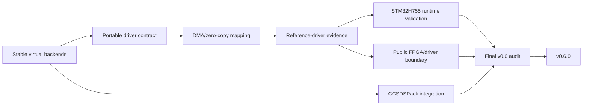

# Roadmap

The roadmap is organized around evidence boundaries rather than aspirational backend names. Stable tags remain immutable; `develop` is the integration branch for the next release.

## Released milestones

### v0.1

Established the portable SpaceWire-facing C API, deterministic loopback/process-local simulation, bounded resource behavior, EOP/EEP, time codes, caller-owned construction and zero-copy ownership semantics.

### v0.2

Added distributed VSPW-TP/UDP, fragmentation/reassembly, session/liveness, retry/deduplication, virtual timing, deterministic transport/SpaceWire fault injection and capture tooling.

### v0.3

Expanded package/consumer and portability evidence while keeping the application API transport-neutral.

### v0.4

Delivered the Linux virtual-device/service boundary:

- `SPW_BACKEND_DEVICE`;
- VSPD;
- `vspwd`;
- `spwctl`;
- `spwmon`;
- installed C/C++ device consumers;
- VSPW-TP bridge integration.

### v0.5.0

Completed hosted-platform parity and embedded/RTOS integration evidence:

- native Windows/Winsock VSPW-TP/UDP;
- production CUSE `/dev/vspwX` presentation;
- HardRT `0.4.0` POSIX execution integration;
- Cortex-M7/HardRT compile-link integration;
- multi-architecture Debian publication (`amd64`, `arm64`, `armhf`, `riscv64`);
- multi-platform GHCR publication.

The `v0.5.0` tag and release assets are immutable.

## v0.6.0 development

The v0.6 objective is a portable software boundary that lets the same application API move from virtual SpaceWire to real platform/vendor drivers without publishing proprietary hardware implementation details.

### Completed on `develop`

- public `SPW_BACKEND_DRIVER` configuration/callback contract;
- driver ABI v2 DMA/zero-copy ownership mapping;
- bounded wrapper slots and no-heap compatibility;
- deterministic host reference driver;
- driver/DMA contract and cache-hook tests;
- installed-package CCSDSPack PUS-C interoperability;
- Linux DEVICE/VSPD CCSDS transport fixture;
- two-node Docker Compose CCSDSPack-over-VSPW-TP/UDP exchange;
- documentation/backend-status reconciliation.

### Provisional CCSDSPack baseline

CCSDSPack is currently consumed from `CCSDSPack/develop` at a deterministic validated snapshot. This is an API/design reference while CCSDSPack is being finalized, **not** the final SpWKit release dependency claim.

Before v0.6.0 release:

- select the user-approved immutable CCSDSPack 2.x release tag/commit;
- replace the provisional branch/snapshot reference;
- rerun installed-package and Compose interoperability evidence.

CCSDSPack remains an integration dependency only; it is not a runtime dependency of `libspwkit`.

### STM32H755 validation (#119)

The planned board validation will prove the public driver/DMA ownership boundary on actual Cortex-M7 silicon, including real DMA execution and explicit cache/coherency handling.

It is not yet counted as complete, and its exact board/test architecture must be agreed before implementation/runtime claims are made.

It is also not SpaceWire electrical HIL.

### Public FPGA/driver boundary (#113)

The public documentation must state the generic software obligations a future FPGA/vendor driver needs to satisfy while keeping proprietary implementation details out of this repository.

The public stop line excludes:

- RTL architecture;
- register/address maps;
- DMA descriptor formats;
- internal bus/clock/reset/interrupt design;
- proprietary IP-core choices.

### Final v0.6 release gate

Before tagging v0.6.0:

- finish #119 evidence according to its agreed scope;
- finish #113 public boundary documentation;
- accept and pin the final CCSDSPack baseline;
- reconcile tracker/issues and stale feature branches;
- run the consolidated CI/release-critical matrix;
- merge `develop` to `main`;
- create one immutable `v0.6.0` tag and publish from that tag.

## Later work

Post-v0.6 directions may include:

- a real FPGA/vendor SpaceWire driver implementation;
- physical SpaceWire HIL/electrical interoperability evidence;
- richer daemon topology/router modeling;
- additional RTOS/platform adapters;
- upper-layer protocols such as RMAP kept modular above the link API;
- broader compliance traceability.

No later milestone is considered delivered merely because an interface placeholder or documentation concept exists.
