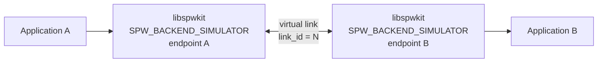
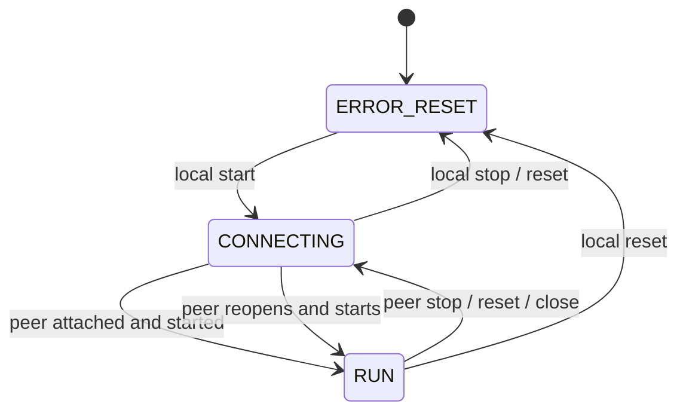
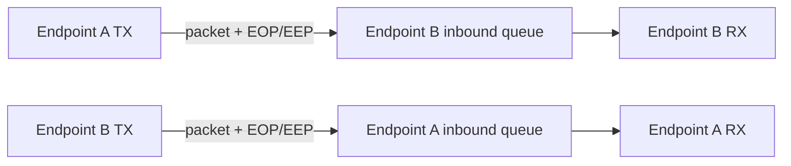
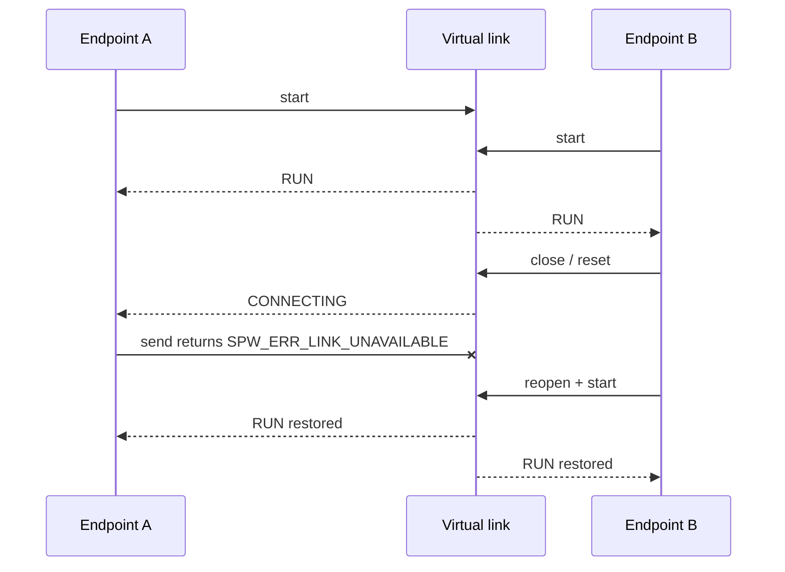
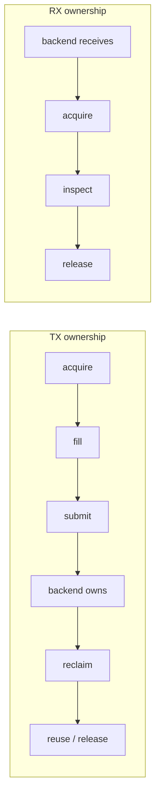
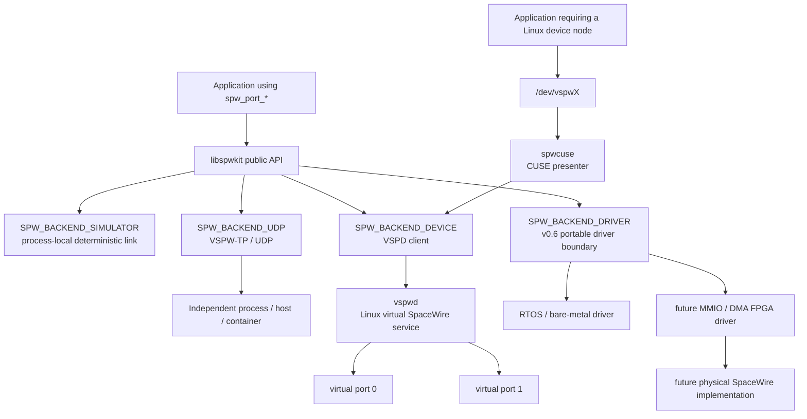
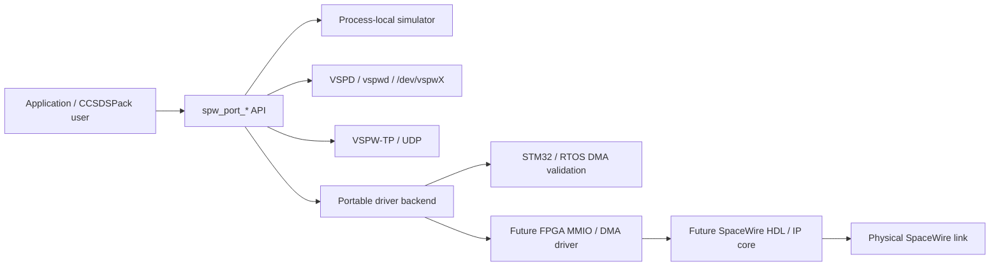

# Local virtual SpaceWire simulator

The original v0.1 simulator is a process-local implementation of the same backend contract used by `libspwkit` for loopback, distributed UDP, Linux virtual devices, and future physical transports.

Applications do not call simulator-specific transport functions. They select the simulator through `spw_port_config_t` and continue to use the normal `spw_port_*` API.



Endpoints A and B are equal SpaceWire peers. The endpoint identifiers exist only to make pairing deterministic. They do not imply client/server, initiator/responder, or master/slave roles.

## Creating a pair

Both ports select `SPW_BACKEND_SIMULATOR`, use the same `link_id`, and select opposite endpoints:

```c
spw_simulator_config_t sim_a = SPW_SIMULATOR_CONFIG_INITIALIZER;
sim_a.link_id = 42;
sim_a.endpoint = SPW_SIMULATOR_ENDPOINT_A;

spw_simulator_config_t sim_b = SPW_SIMULATOR_CONFIG_INITIALIZER;
sim_b.link_id = 42;
sim_b.endpoint = SPW_SIMULATOR_ENDPOINT_B;
```

Each simulator configuration is passed through the ordinary `spw_port_config_t` backend configuration field. `spw_port_open()` copies the identity needed by the backend; the application does not have to retain the configuration objects after the call returns.

A process may host multiple independent virtual links. The local simulator reserves a fixed registry of 16 local links. Opening the same endpoint twice on one link is rejected with `SPW_ERR_RESOURCE_EXHAUSTED`.

## Link lifecycle

Each local endpoint begins in `SPW_LINK_ERROR_RESET`. Starting one endpoint moves it to `SPW_LINK_CONNECTING`; the link reaches `SPW_LINK_RUN` only when both peers are attached and started.



Stopping, resetting, or closing one peer makes a still-started peer return to `SPW_LINK_CONNECTING`. Packet and time-code transmission from that surviving endpoint returns `SPW_ERR_LINK_UNAVAILABLE` until the opposite peer is available again.

A missing peer can be reopened using the same `link_id` and endpoint identity. Starting it restores both started endpoints to `SPW_LINK_RUN`; the surviving `spw_port_t` handle does not need to be recreated.

This is a software-visible behavioral model. It does not claim to reproduce every intermediate timing state of the ECSS SpaceWire link state machine at character or signal level.

## Packet transfer

Each endpoint owns an independent inbound packet queue. Sending on A writes to B's queue and sending on B writes to A's queue.



The local simulator preserves:

- complete packet boundaries;
- payload bytes;
- EOP/EEP termination;
- zero-length packets;
- receive-buffer-too-small behavior without consuming the queued packet;
- bidirectional/full-duplex use from independent threads.

The current limits are:

| Resource | Local simulator |
|---|---:|
| maximum packet payload | 4096 bytes |
| inbound packet queue | 8 packets per endpoint |
| inbound time-code queue | 8 time codes per endpoint |
| local virtual links | 16 |

An immediate send to a full peer queue returns `SPW_ERR_RESOURCE_EXHAUSTED`. A finite or infinite timeout may wait for queue space. Receive operations similarly support immediate, finite, and infinite waits.

## Time codes

Time codes use the same peer direction as packets. A time code sent by A is received by B and vice versa. Ordinary local-simulator time-code validation remains limited to a six-bit count with zero control flags, as defined by the public type contract.

## Disconnect and recovery

Closing or resetting an endpoint notifies its peer. The peer remains a valid application object but is no longer considered connected. Reopening and starting the missing endpoint restores the virtual link without forcing the surviving peer to recreate its handle.



This provides the deterministic disconnect/recovery baseline needed by the simulator contract without inventing Ethernet or operating-system failure semantics.

## Statistics

Statistics are maintained per endpoint. TX counters belong to the transmitting endpoint and RX counters belong to the endpoint that consumes the queued item. Link error counters increase when a running peer disappears or resets.

## Threading

The local virtual link is synchronized internally and supports concurrent A-to-B and B-to-A operations. This permits full-duplex integration tests without requiring a network transport.

The lifetime of a single `spw_port_t` object must still be coordinated by the application. Closing a port concurrently with another thread using that same handle is outside the local-simulator contract.

## Zero-copy ownership

The local simulator advertises `SPW_CAP_ZERO_COPY` and implements the same ownership-oriented API available to applications:



The simulator uses fixed aligned host-memory buffers and may copy internally while preserving the application-visible ownership, capacity, timeout and completion semantics.

This is intentional. A DMA-capable backend can map the same API to coherent or pinned memory and descriptor rings without exposing hardware addresses or descriptor types to applications.

## Simulation and virtual-device stack today

The process-local simulator remains the deterministic behavioral reference, but it is no longer the only virtual SpaceWire path. Stable `v0.5.0` includes the distributed VSPW-TP/UDP backend, Linux VSPD virtual-device service, `vspwd`, management/monitoring tools, and optional CUSE `/dev/vspwX` presentation. `develop` additionally carries the v0.6 portable hardware-driver/DMA boundary.



The UDP backend is a separate backend, not an extension of the process-local simulator API. VSPD/`vspwd` similarly provides independent-process Linux virtual-device semantics rather than sharing the process-local registry. All of these paths remain hidden behind the same SpaceWire-facing application concepts.

For a CAN-style development analogy, `vspwd` plus VSPD provides the shared virtual-link service, while `spwcuse` can expose virtual endpoints as `/dev/vspwX`. Unlike Linux `vcan`, this is userspace-backed rather than a native Linux network-device driver. That distinction is deliberate because SpaceWire packet terminators, time codes, and link lifecycle do not naturally map to a generic byte stream or ordinary network interface.

## Path from simulation to hardware

The application-facing contract is intentionally stable while the transport implementation becomes progressively more physical:



The current STM32 work therefore validates the public driver and DMA ownership boundary, not the SpaceWire electrical layer. A future FPGA implementation can replace the lower hardware-specific portion without changing application code or the `spw_port_*` API.

## What this simulator is not

The process-local backend itself is not `vspwd`, a Linux character device, an electrical/Data-Strobe simulator, or a physical SpaceWire implementation. Those are separate layers or future hardware concerns.

SpWKit's current virtual stack provides packet/link behavioral simulation and virtual-device integration. It does not claim signal-level Data/Strobe behavior, LVDS electrical characteristics, bit/character timing, physical PHY interoperability, or a real FPGA SpaceWire core.
