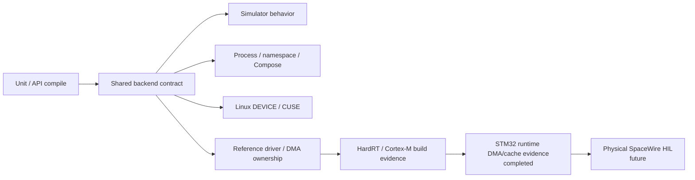
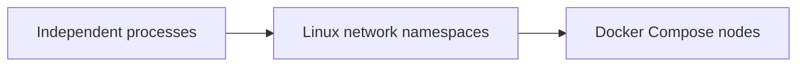

# Testing and CI strategy

SpWKit verifies one observable public SpaceWire contract across every backend. Unit/implementation tests add depth, but they do not replace the common application-facing contract.

## Evidence layers



A green result at one layer is not presented as evidence for a later layer.

## Consolidated CI

The current `.github/workflows/ci.yml` owns the main verification matrix. It includes hosted/compiler, pure-C, package, distributed, virtual-device, CUSE, RTOS, driver and integration jobs rather than relying on the older release-specific workflow descriptions that existed during v0.4 development.

Key active evidence includes:

- Linux GCC and Clang;
- macOS Clang;
- Windows MSVC;
- native Windows/Winsock VSPW-TP runtime;
- pure-C runtime with `CXX=/bin/false`;
- static and shared installed-package consumers;
- optional C++17 wrapper consumers without exceptions/RTTI;
- no-heap/freestanding profiles;
- ASan/UBSan jobs;
- process-local simulator contract/edge cases;
- VSPW-TP transport/golden/malformed/reordering/timing/fault tests;
- independent process and Linux network-namespace D2D tests;
- Docker Compose distributed tests;
- Linux DEVICE/VSPD/`vspwd` tests;
- `spwctl`/`spwmon` management/monitor tests;
- live `/dev/cuse` character-device contract where runner support exists;
- installed C/C++ device consumers and mixed-language pairs;
- HardRT `0.4.0` POSIX and Cortex-M7 integration;
- driver backend, DMA/ownership and deterministic reference-driver tests;
- physical NUCLEO-H755ZI-Q DMA/cache qualification through the public driver boundary;
- CCSDSPack `v2.0.0` installed-package integration plus the separate reproducible two-node Compose harness.

## Pure-C runtime gate

A valid C-only profile must configure, build, execute, install and link without discovering or invoking a C++ compiler.

This gate verifies:

- C11 library/archive behavior;
- simulator/UDP C paths where enabled;
- no C++ ABI/runtime symbols in the C library;
- independent installed C consumer;
- static/shared C consumption;
- caller-owned/no-heap construction.

The C++ wrapper is optional and cannot become the only proof of runtime behavior.

## C++17 wrapper gate

When enabled, the wrapper is compiled with C++17, exceptions disabled and RTTI disabled. Tests/examples verify it delegates to the same C runtime.

Coverage includes:

- RAII/move-only port lifetime;
- workspace requirements and in-place construction surface;
- copied DATA and capability-gated behavior;
- successful simulator zero-copy acquire/fill/submit/RX/release/reclaim ownership;
- installed `spwkit::cpp` consumer behavior.

## Shared backend contract

The reusable backend contract verifies, as applicable:

- lifecycle and observable link state;
- complete packet transfer;
- EOP/EEP preservation;
- zero-length and large packets;
- undersized receive without truncation/consumption;
- immediate and finite timeout behavior;
- bounded resources and recovery;
- time codes when advertised;
- statistics when advertised;
- readiness when advertised;
- zero-copy ownership when advertised.

Capabilities gate genuinely optional behavior. Advertising a capability without satisfying the corresponding tests is a failure.

Distributed fixtures may use a finite success budget because transport ACK/liveness is asynchronous; explicit timeout/non-blocking contract cases remain fixed and cannot be weakened by that fixture budget.

## Process-local simulator

Simulator-specific tests add:

- A/B pairing and duplicate-endpoint rejection;
- link slot exhaustion;
- missing-peer CONNECTING behavior;
- stop/reset/close/reopen recovery;
- bounded packet/time-code queues;
- exact size boundaries;
- full-duplex/concurrent peer behavior;
- zero-copy pool exhaustion and ownership errors;
- copied/zero-copy interoperability.

The simulator is software-visible behavioral evidence, not Data-Strobe/electrical timing evidence.

## Distributed VSPW-TP

### Public backend contract

Two public UDP ports verify application-facing lifecycle, packets, EOP/EEP, time codes, statistics, peer loss/restart and recovery.

### Transport-specific tests

Separate tests cover:

- frame validation/golden vectors;
- fragmentation/reassembly;
- arbitrary-order/duplicate/overlap handling;
- session-bound ACK/retry/deduplication;
- keepalive/peer timeout and new-session restart;
- virtual rate/latency;
- deterministic transport faults;
- explicit SpaceWire-side EEP injection.

### Independent nodes

The D2D gate includes:



The namespace topology uses a real veth/IP boundary. Compose adds deployment-shaped container/network isolation. These are stronger software-network boundaries, not physical SpaceWire hardware.

## CCSDSPack integration

The v0.7 integration builds CCSDSPack and SpWKit as independent installed packages and verifies byte-exact PUS-C TC/TM exchange over SpWKit.

The consolidated CI gate independently checks out immutable CCSDSPack `v2.0.0`, verifies commit `c2f318c330c564429bcc565a8acbff22728b2851`, builds both installed packages separately, and executes the UDP peer exchange. A moving `CCSDSPack/develop` branch is not release evidence.

The separate `integrations/ccsdspack_v2/run_compose.sh` harness repeats the same public integration in two isolated containers. It requires PASS from both peers and keeps EOP separate from CCSDS packet bytes. Its default Docker/Compose baseline is the same immutable `v2.0.0` release.

## Linux virtual device

VSPD/`vspwd` verification covers:

- protocol golden/malformed frames;
- seqpacket behavior;
- daemon lifecycle and cleanup;
- public DEVICE backend contract;
- readiness;
- peer loss/restart;
- statistics;
- management/monitoring;
- DEVICE↔VSPW-TP bridge behavior;
- installed C/C++ process pairs.

## CUSE

The early `cuse-feasibility.md` work is retained as a historical design record. v0.5 shipped production `spwcuse`, and the stable v0.7 line retains it. CI includes a live `/dev/cuse` character-device contract where the runner exposes CUSE.

The contract checks packet-record behavior, DATA/EOP/EEP/time codes, zero-length packets, non-consuming short reads, non-blocking empty reads, poll/readiness and endpoint ownership.

CUSE/libfuse remains outside the public `libspwkit` ABI.

## Driver / DMA

The stable v0.7 line verifies:

- required callback/capability consistency;
- lifecycle and copied DATA mapping;
- zero-copy DMA acquire/submit/reclaim/release;
- pointer/ownership transitions and reset-safe ownership epochs;
- cache hook ordering;
- stale/foreign token rejection;
- bounded wrapper slots;
- no-heap/freestanding driver use;
- the deterministic reference provider through the same reusable public backend contract as virtual backends.

These are software driver-contract tests. The separate NUCLEO-H755ZI-Q qualification adds physical MCU DMA/cache evidence but still does not prove a SpaceWire controller or PHY.

## HardRT and Cortex-M

HardRT release `0.4.0` is the validated external RTOS baseline.

- POSIX integration executes installed HardRT and SpWKit together.
- Cortex-M7 integration cross-builds/links HardRT plus no-heap SpWKit for ARMv7E-M/Thumb with hosted backends disabled.

That CI result remains compile/link/ABI evidence. Runtime DMA/cache behavior is established separately by the physical NUCLEO-H755ZI-Q qualification.

## STM32H755 qualification

The physical board campaign has completed successfully on NUCLEO-H755ZI-Q. It exercises real DMA2 memory-to-memory transfers and explicit Cortex-M7 D-cache clean/invalidate ownership transitions through `SPW_BACKEND_DRIVER`, including copied and zero-copy paths and reset-time stale-buffer invalidation.

The accepted phase-7 result records `magic=0x53505736`, `phase=0x0000700d`, `result=0`, two DMA transfers, two TX packets, two RX packets, synchronization in both directions, and `reset_stale_invalidated=1` (`RESULT: PASS`).

This is physical MCU driver/DMA/cache evidence. It is not SpaceWire controller, codec, Data-Strobe, LVDS, cable or electrical interoperability evidence.

## Physical HIL

The HIL workflow remains explicit/manual and must not be satisfied by hosted simulation, QEMU, Docker, CUSE, or generic MCU DMA. Physical SpaceWire claims require real controller/PHY/link evidence with the required harness.

## Installed-package verification

Consumers are configured as independent projects using exported targets only:

```cmake
find_package(SpWKit 0.7 CONFIG REQUIRED)
target_link_libraries(c_app PRIVATE spwkit::spwkit)
```

Optional C++:

```cmake
find_package(SpWKit 0.7 CONFIG REQUIRED)
target_link_libraries(cpp_app PRIVATE spwkit::cpp)
```

Stable v0.7.0 consumers request the v0.7 package line. The immutable v0.7.0 tag is the release evidence boundary for that package version.

## Determinism rules

- no test depends on execution order or persistent runner state;
- bounded resources have explicit limits;
- randomized behavior reports/configures its seed;
- finite timeout tests use bounded waits rather than claiming real-time conformance from CI wall-clock timing;
- packet tests use binary data and exact boundaries;
- dependency snapshots/tags used as evidence are explicit and fail closed if unexpectedly changed.

## Compliance evidence

Automated tests are engineering evidence supporting the explicitly scoped software-conformance matrix; they are not automatic whole-system ECSS certification. Electrical, Data-Strobe, exact timing and physical interoperability requirements remain outside packet-level software simulation and require corresponding hardware verification.
