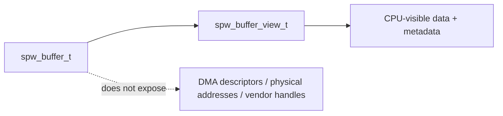

# Core public types

This document describes the current software-visible value types used by SpWKit. The types are deliberately independent from simulator internals, operating systems, socket APIs, DMA engines, RTOS objects and vendor SDKs.

## Result values

`spw_result_t` is a signed 32-bit integer. `SPW_OK` is zero and failures are negative.

| Result | Meaning |
|---|---|
| `SPW_OK` | operation completed successfully |
| `SPW_ERR_INVALID_ARGUMENT` | invalid pointer, value or configuration |
| `SPW_ERR_INVALID_STATE` | operation is not legal in the current state |
| `SPW_ERR_TIMEOUT` | operation did not complete inside the requested timeout |
| `SPW_ERR_UNSUPPORTED` | optional backend/capability is unavailable |
| `SPW_ERR_RESOURCE_EXHAUSTED` | bounded queue/pool/resource is exhausted |
| `SPW_ERR_LINK_UNAVAILABLE` | peer/link/service is unavailable |
| `SPW_ERR_BUFFER_TOO_SMALL` | caller receive storage cannot hold the complete packet |
| `SPW_ERR_INVALID_PACKET` | packet metadata or terminator is invalid |
| `SPW_ERR_BACKEND` | backend-specific failure not represented more precisely |

## Timeouts

`spw_timeout_us_t` is an unsigned 64-bit microsecond count.

```text
SPW_TIMEOUT_IMMEDIATE = 0
SPW_TIMEOUT_INFINITE  = UINT64_MAX
```

This keeps POSIX `timespec`, RTOS ticks and platform timers out of the ABI.

## Packet terminator

A complete packet terminates with:

```text
SPW_TERMINATOR_EOP
SPW_TERMINATOR_EEP
```

EOP is normal termination; EEP is error termination. Backends preserve this metadata across simulator queues, VSPW-TP, VSPD, CUSE presentation and driver boundaries.

## Copied packet type

`spw_packet_t` contains:

```c
uint8_t* data;
size_t length;
size_t capacity;
spw_terminator_t terminator;
```

### Send

The caller owns the payload for the duration of `spw_port_send()`. `length` is the complete logical packet size. A non-zero capacity must not be smaller than length.

### Receive

The caller provides writable storage and capacity. On success, length/terminator describe the complete received packet.

If the next packet is too large, SpWKit returns `SPW_ERR_BUFFER_TOO_SMALL`, reports complete required length and terminator, does not partially overwrite caller storage, and keeps the packet queued for retry.

Zero-length packets are valid and still carry EOP or EEP.

## Link state

`spw_link_state_t` provides the common SpaceWire-oriented vocabulary:

```text
SPW_LINK_ERROR_RESET = 0
SPW_LINK_ERROR_WAIT  = 1
SPW_LINK_READY       = 2
SPW_LINK_STARTED     = 3
SPW_LINK_CONNECTING  = 4
SPW_LINK_RUN         = 5
```

A backend maps what it can meaningfully observe into these values. Software backends are not required to synthesize transient hardware phases they cannot observe.

For example, the process-local simulator exposes stable transitions such as:

```text
open/reset              -> ERROR_RESET
stop                    -> READY
start without peer      -> CONNECTING
both peers started      -> RUN
peer stop/reset/close   -> surviving started peer CONNECTING
peer restart/reopen     -> RUN
```

The Linux DEVICE/VSPD path can additionally expose `ERROR_WAIT` when an established peer disappears.

## Time codes

`spw_time_code_t` contains a six-bit time count and control flags. Ordinary current operation accepts time counts 0..63 and zero control flags. Broader broadcast-code extensions remain outside the present common contract.

## Capabilities

`spw_capabilities_t` advertises optional behavior and resource constraints. Current capability areas include:

```text
SPW_CAP_EEP
SPW_CAP_TIME_CODE
SPW_CAP_LINK_CONTROL
SPW_CAP_STATISTICS
SPW_CAP_RATE_CONTROL
SPW_CAP_FAULT_INJECTION
SPW_CAP_ZERO_COPY
SPW_CAP_READINESS
```

Capabilities also describe constraints such as maximum packet size, queue depth and buffer alignment. A backend must not advertise a capability it cannot satisfy under the shared contract.

## Statistics

`spw_statistics_t` provides common diagnostic counters for transmitted/received packets and bytes, time codes, EEP packets, link errors and dropped/resource-exhausted traffic.

`spw_fault_statistics_t` is optional and deliberately distinguishes VSPW-TP carrier faults from explicit SpaceWire-visible fault injection.

## Zero-copy types

`spw_buffer_t` is opaque. Application-owned buffers are inspected through `spw_buffer_view_t`, which provides CPU-visible data/capacity/length/terminator only during the appropriate ownership phase.



The simulator may back this view with aligned host memory. The v0.6 driver backend may wrap a driver DMA buffer token. The application type and ownership rules remain the same.

## Driver types

`<spwkit/driver.h>` defines versioned backend-specific types such as `spw_driver_config_t`, `spw_driver_ops_t` and driver buffer descriptors/tokens used at the driver callback boundary.

These are **backend configuration/driver integration types**, not replacements for `spw_packet_t`, `spw_buffer_t` or common link state at the application layer. Native hardware register/descriptor types remain below that boundary.

## ABI discipline

Fixed-width enum/value encodings and versioned structures are intentional. Private implementation object sizes and native mechanism types are not part of the public ABI.
