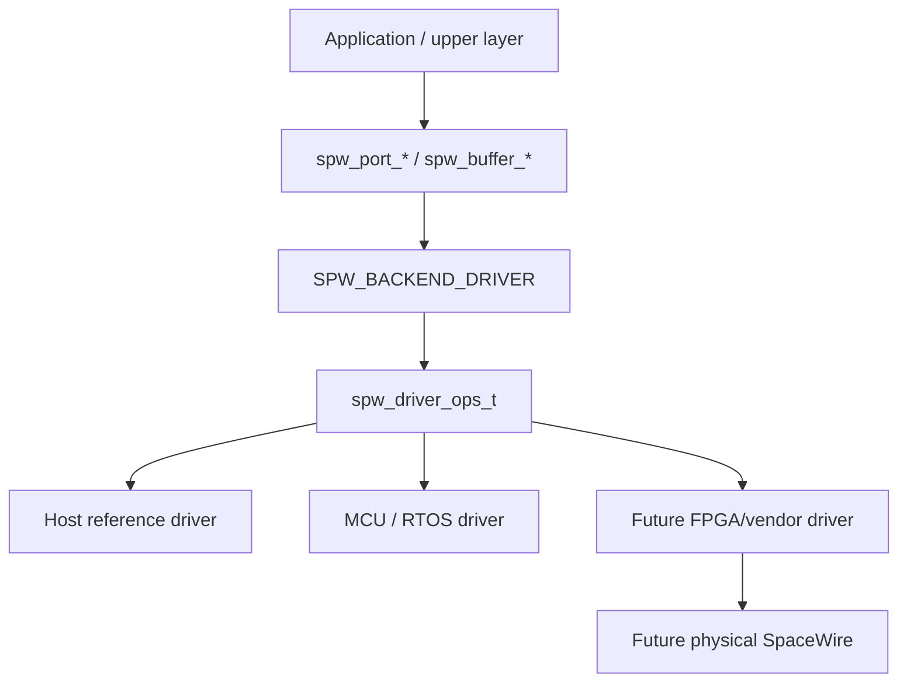

# v0.6 hardware integration boundary

The v0.6 milestone defines a **portable software contract** for hardware-backed SpaceWire integrations. It does not implement or publish a proprietary FPGA SpaceWire core.

## Boundary

The public repository owns the layers through the portable driver contract and generic acceptance criteria. Platform/vendor implementations below that line may remain independent or proprietary.

## Completed on `develop`

- versioned public driver configuration/callback contract;
- capability validation;
- copied DATA lifecycle mapping;
- driver ABI v2 DMA/zero-copy ownership callbacks;
- optional driver cache synchronization hooks;
- bounded SpWKit buffer-wrapper slots inside caller-owned workspace;
- deterministic host reference-driver execution;
- no-heap/freestanding driver/DMA evidence.

## STM32H755 validation (#119)

The next MCU evidence is intended to prove that the generic driver/DMA ownership model can be exercised on real Cortex-M7 silicon with actual DMA and explicit cache/coherency handling.

This task remains pending until its exact board/test architecture is agreed. Its runtime result will be **MCU DMA/cache evidence**, not physical SpaceWire electrical HIL.

## Future FPGA/driver boundary (#113)

The public hardware-facing documentation should define only generic software obligations, for example:

- how a driver maps controller link state into `spw_link_state_t`;
- how complete DATA/EOP/EEP and time codes enter/leave the driver;
- when ownership passes between CPU and controller;
- which callbacks/capabilities are required;
- how errors and statistics map into portable result/diagnostic concepts;
- generic HIL acceptance criteria visible at the public API boundary.

## Explicitly outside the public v0.6 design

Do not publish or invent:

- proprietary RTL architecture;
- register/address maps;
- DMA descriptor layouts;
- internal AXI/bus structure;
- clock/reset/interrupt implementation;
- IP-core/vendor selection;
- electrical/PCB design.

A real implementation can satisfy the software contract without disclosing those details.

## Acceptance principle

A future hardware driver is acceptable when it can replace a virtual backend beneath the normal application API and pass the shared contract for the capabilities it advertises, plus the hardware/HIL evidence appropriate to that platform.

No earlier stage is presented as proof of a later one.
