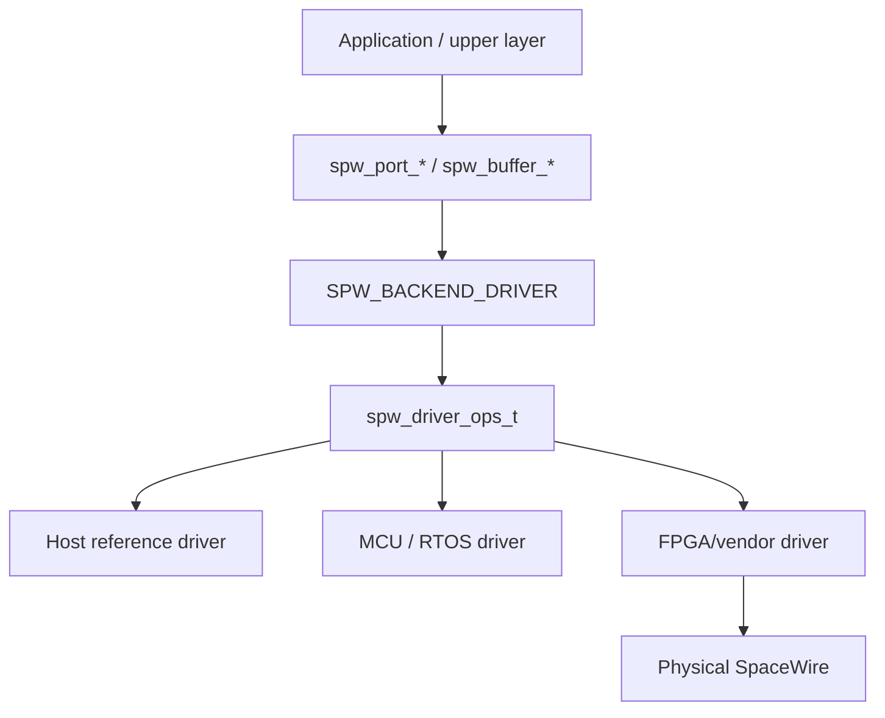
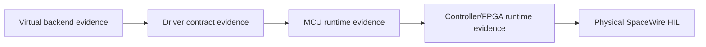

# v0.6 hardware integration boundary

The v0.6 milestone defines a **portable software contract** for hardware-backed SpaceWire integrations. It does not implement or publish a proprietary FPGA SpaceWire core.

## Boundary



The public repository owns the layers through the portable driver contract and generic acceptance criteria. Platform/vendor implementations below that line may remain independent or proprietary.

## Completed v0.6 scope

- versioned public driver configuration/callback contract;
- capability validation;
- copied DATA lifecycle mapping;
- driver ABI v2 DMA/zero-copy ownership callbacks;
- optional driver cache synchronization hooks;
- bounded SpWKit buffer-wrapper slots inside caller-owned workspace;
- deterministic host reference-driver execution;
- no-heap/freestanding driver/DMA evidence;
- provider/fast-path guidance that permits native PIO, DMA, vendor SDK, PCIe, or other implementations below the same public contract;
- proprietary-safe FPGA/HDL stop line;
- generic physical-provider and HIL acceptance criteria in [`hardware-acceptance.md`](hardware-acceptance.md);
- immutable CCSDSPack `v2.0.0` interoperability baseline;
- physical STM32H755 runtime qualification of the driver/DMA/cache ownership boundary.

## STM32H755 validation (#119)

The STM32H755 integration proves that the generic driver/DMA ownership model can execute on real Cortex-M7 silicon with actual DMA and explicit cache/coherency handling.

The NUCLEO-H755ZI-Q integration contains:

- standalone Cortex-M7 evidence firmware;
- DMA2 memory-to-memory transfers using DMA-visible D2 SRAM;
- real D-cache clean/invalidate synchronization through the public driver contract;
- copied and zero-copy packet paths;
- reset-time stale-buffer invalidation through the public API;
- debugger-visible pass/fail evidence;
- a reproducible CMake cross-build;
- CI build/link verification against a pinned STM32CubeH7 CMSIS baseline;
- a scripted OpenOCD/GDB board execution path.

The physical phase-7 run recorded:

```text
magic                   = 0x53505736
phase                   = 0x0000700d
result                  = 0x00000000
sync_to_device          = 1
sync_from_device        = 1
dma_transfers           = 2
tx_packets              = 2
rx_packets              = 2
reset_stale_invalidated = 1
RESULT: PASS
```

This is **MCU DMA/cache/zero-copy evidence**, not physical SpaceWire electrical HIL.

See [`../integrations/stm32h755_dma/README.md`](../integrations/stm32h755_dma/README.md).

## FPGA/driver boundary (#113)

The public FPGA/driver boundary is intentionally semantic rather than implementation-specific. Public documentation defines:

- how a provider maps controller link state into `spw_link_state_t`;
- how complete DATA/EOP/EEP and time codes enter/leave the driver;
- when ownership passes between CPU and controller;
- which callbacks/capabilities are required;
- how errors and statistics map into portable result/diagnostic concepts;
- how copied and true zero-copy paths may map onto different native implementations;
- generic physical-provider/HIL acceptance criteria visible at the public API boundary.

The public design does **not** require every implementation to use a common private register map, bus, DMA descriptor format, or hot-path datapath. `spw_driver_ops_t` is the stable semantic boundary; optimized implementation stays below it.

## Explicitly outside the public v0.6 design

Do not publish or invent:

- proprietary RTL architecture;
- register/address maps;
- DMA descriptor layouts;
- internal AXI/bus structure;
- clock/reset/interrupt implementation;
- proprietary IP-core/vendor selection;
- electrical/PCB design.

A real implementation can satisfy the software contract without disclosing those details.

## Acceptance principle

A hardware driver is acceptable when it can replace a virtual backend beneath the normal application API and pass the shared contract for the capabilities it advertises, plus the hardware evidence appropriate to that platform.



The detailed public checklist is [`hardware-acceptance.md`](hardware-acceptance.md).

No earlier stage is presented as proof of a later one. In particular:

- host/reference-driver success is not real DMA evidence;
- STM32H755 DMA/cache success is not SpaceWire PHY evidence;
- physical interoperability HIL is not a blanket ECSS/electrical qualification claim.
