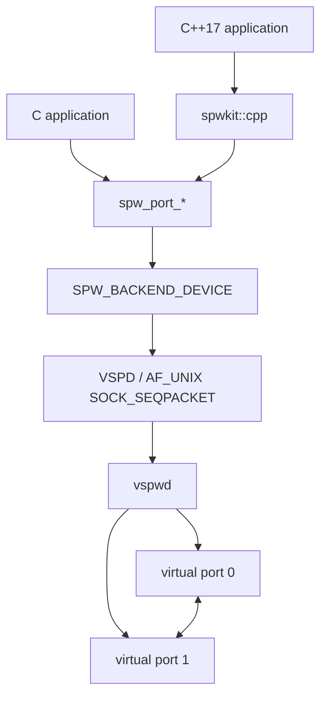
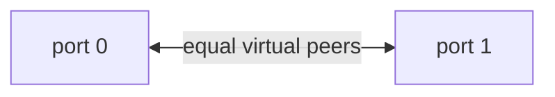
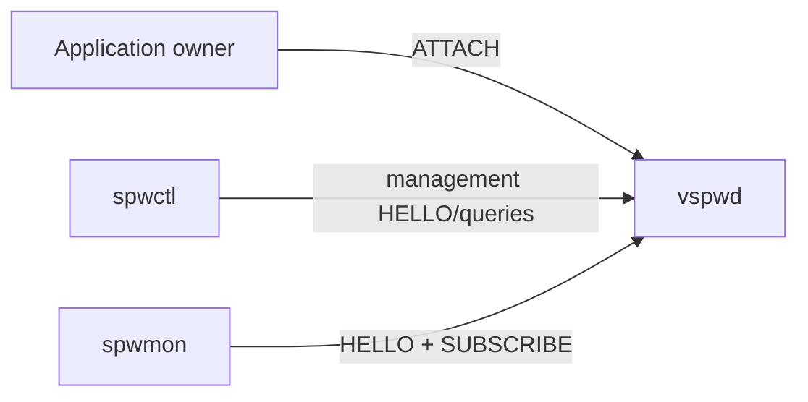

# `vspwd` userspace virtual SpaceWire service

`vspwd` is the Linux userspace virtual SpaceWire service introduced in v0.4. Applications attach through the normal `SPW_BACKEND_DEVICE` API and the private VSPD protocol.



Applications do not need VSPD headers, Unix descriptors or daemon-private state.

## Build

```sh
cmake -S . -B build-device \
  -DSPWKIT_BUILD_DEVICE=ON \
  -DSPWKIT_BUILD_VSPWD=ON
cmake --build build-device
```

`SPWKIT_BUILD_VSPWD` defaults to `OFF`; the linked Linux DEVICE backend is enabled by default where supported. `vspwd` remains an explicit hosted service so portable/library-only builds do not accidentally acquire a daemon dependency.

## Public configuration

```c
spw_device_config_t device = SPW_DEVICE_CONFIG_INITIALIZER(0u);
spw_port_config_t config = SPW_PORT_CONFIG_INITIALIZER(SPW_BACKEND_DEVICE);
config.backend_config = &device;
config.backend_config_size = sizeof(device);

spw_port_t* port = NULL;
spw_result_t result = spw_port_open(&config, &port);
```

The public device configuration contains only version/size fields, daemon `port_id`, and a bounded endpoint path. The default development endpoint is `/tmp/spwkit-vspwd.sock`.

## Run

```sh
./build-device/vspwd
```

or:

```sh
./build-device/vspwd --socket /tmp/my-mission-vspwd.sock
```

`SIGINT`/`SIGTERM` stop the daemon and remove the socket path.

## Reference topology

The current daemon exposes a deliberately small deterministic two-port topology:



One application attachment owns each port. Both attached ports must be started before the pair is `RUN`. A surviving peer can remain alive across disconnect/replacement of the other process.

Typical stable states include:

```text
attached, not started      READY
started, peer not ready    CONNECTING
both peers started         RUN
established peer lost      ERROR_WAIT
explicit reset             ERROR_RESET
```

## Public backend behavior

`SPW_BACKEND_DEVICE` maps the normal contract onto VSPD:

- start/stop/reset lifecycle requests;
- common link state;
- complete DATA with EOP/EEP;
- time codes;
- non-consuming readiness;
- statistics;
- peer loss/reconnect/re-attach behavior;
- complete-packet `SPW_ERR_BUFFER_TOO_SMALL` retry semantics.

Zero-copy is currently not advertised by the DEVICE backend.

The backend is cooperative; it has no mandatory worker thread. Synchronous requests may service asynchronous DATA/TIME_CODE/LINK_STATE events internally while waiting for their response.

## Data path and bounds

VSPD DATA fragments are reassembled inside `vspwd` before one logical packet is accepted. DATA_RX fragments are reassembled in the DEVICE backend before one packet reaches the application.

Current reference bounds include:

```text
VSPD record payload       32 KiB
logical packet maximum     1 MiB
queued logical packets     2 per destination port
queued time codes          8 per destination port
client slots               4
```

Queueing is bounded; resource exhaustion is reported rather than hidden behind unbounded daemon memory.

## Disconnect and restart

Client disconnect releases its attachment, clears its queued inbound data/time codes and partial transmit reassembly, and updates the surviving peer state.

The surviving public `spw_port_t` remains valid. A replacement process can attach/start on the missing port and restore the pair to `RUN` without forcing the survivor to recreate its handle.

## Management and monitoring

Build optional tools with `SPWKIT_BUILD_TOOLS=ON`.

`spwctl` opens a management connection and never ATTACHes to an application port:

```sh
spwctl list
spwctl show 0
spwctl stats 0
spwctl clear-stats 0
```

`spwmon` passively subscribes to bounded state/statistics snapshots without consuming DATA/time codes or displacing the application owner.



## CUSE `/dev/vspwX` presentation

The v0.4 feasibility study originally treated CUSE as later work. **v0.5 subsequently shipped the production `spwcuse` presenter.**

```mermaid
flowchart LR
    RAW[Raw device-node application] --> NODE[/dev/vspw0]
    NODE --> CUSE[spwcuse]
    CUSE --> DEV[SPW_BACKEND_DEVICE]
    DEV --> D[vspwd]
```

The presenter is packet-record oriented, supports DATA EOP/EEP, zero-length packets, time codes and poll/readiness, and keeps libfuse outside `libspwkit`. See [cuse.md](cuse.md).

## VSPW-TP/UDP bridge

`vspwd` can reserve one virtual port as a VSPW-TP/UDP endpoint while the opposite port remains a normal local DEVICE application port.


Example:

```sh
vspwd --socket /tmp/vspwd.sock \
  --bridge-port 1 \
  --udp-local-port 46001 \
  --udp-remote-port 46002 \
  --udp-remote-address 127.0.0.1 \
  --udp-link-id 42 \
  --udp-keepalive-ms 1000 \
  --udp-peer-timeout-ms 3000
```

The bridge reuses the normal UDP backend instead of embedding another VSPW-TP implementation in the daemon. A bridged port rejects ordinary VSPD ATTACH requests and is reported as `bridged` by management/monitoring.

## Memory/resource model

The daemon is single-threaded and `poll()` driven with fixed/bounded storage after initialization. The DEVICE client context also uses bounded state/reassembly storage.

With `SPWKIT_ENABLE_HEAP=OFF`, applications can still use DEVICE with caller-owned port workspace through `spw_port_open_in_place()`.

## Current CI evidence

The consolidated CI validates VSPD protocol behavior, daemon/public DEVICE integration, peer restart, readiness, statistics, installed C/C++ consumers, mixed-language pairs, management/monitoring, bridge behavior, sanitizers and production CUSE presentation where `/dev/cuse` is available.

## Scope

`vspwd` is a software virtual-device service. It does not claim generic SpaceWire router fidelity, physical FPGA/PHY operation or electrical interoperability.
