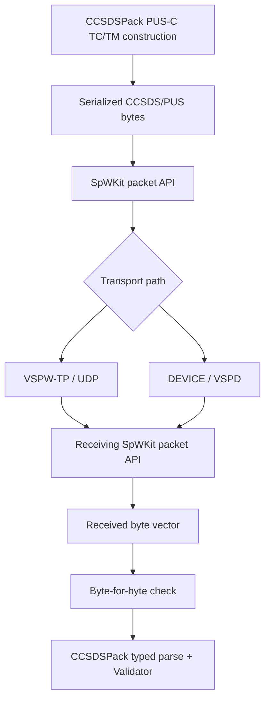
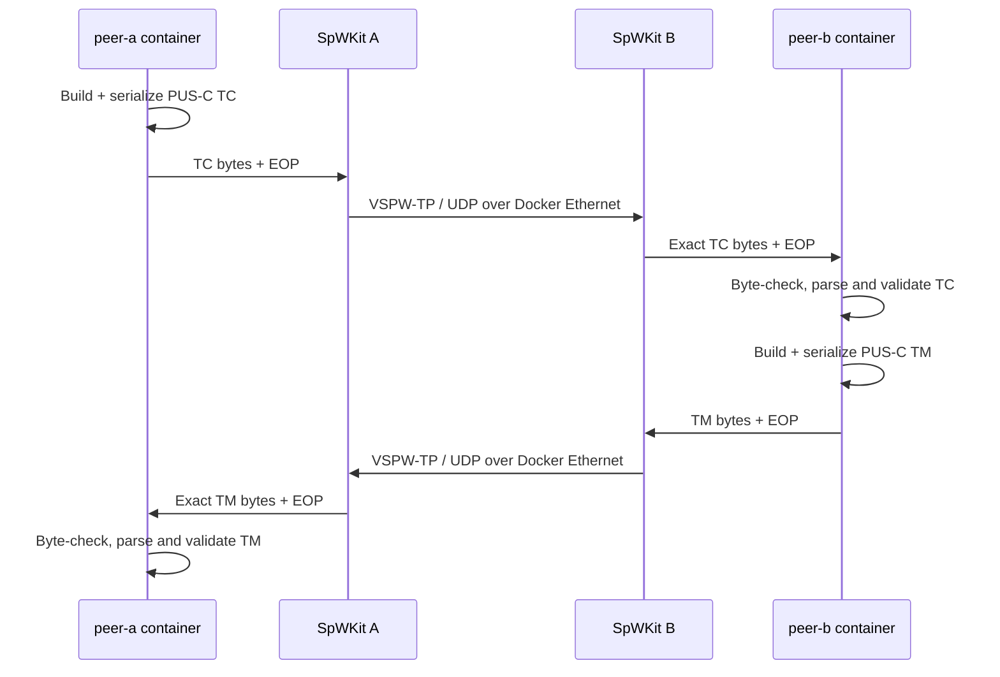
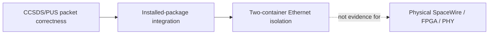

# CCSDSPack 2.x integration

This integration proves the intended layering between CCSDSPack and SpWKit using only each project's installed public package API.

## Immutable dependency baseline

The accepted baseline is:

- repository: `ExoSpaceLabs/CCSDSPack`;
- release tag: `v2.0.0`;
- release commit: `c2f318c330c564429bcc565a8acbff22728b2851`.

CI and the Docker Compose harness verify the exact commit behind the immutable tag so the integration cannot silently follow a moving CCSDSPack branch.

CCSDSPack is an integration dependency only. `libspwkit` does not include CCSDSPack headers, link to CCSDSPack, parse CCSDS/PUS packets, or depend on the CCSDSPack runtime.

## Layering



The SpaceWire EOP terminator remains transport metadata. It is not part of the serialized CCSDS packet bytes and is checked separately.

## Packet contract

The standalone integration peer builds against installed `spwkit::cpp` and `ccsdspack::CCSDSPack` targets.

Peer A:

- creates a PUS-C telecommand with service `17/1`, source ID `0x1234`, acknowledgement flags `0x09`, and application bytes `60 70`;
- serializes it with CCSDSPack;
- transports the resulting bytes through SpWKit;
- independently constructs the expected PUS-C telemetry bytes for the peer response;
- requires exact byte equality before parsing;
- deserializes the received packet as `ccsds::pus::rev_c::TmHeader` and validates its metadata and packet coherence.

Peer B performs the inverse operation with a PUS-C telemetry packet using service `3/25`, message-type counter `7`, destination ID `0x0102`, time-reference status `5`, a four-octet implicit CUC timestamp, and application bytes `80 81`.

The repository provides application-level evidence over:

1. independent VSPW-TP/UDP peers;
2. independent Linux DEVICE peers attached to `vspwd` through VSPD;
3. a deployment-shaped Docker Compose topology with two independent containers and IPv4 endpoints on an isolated Ethernet bridge.

## Two-node CCSDS over Ethernet



Run it from the repository root:

```bash
bash integrations/ccsdspack_v2/run_compose.sh
```

The wrapper:

- builds an image from `integrations/ccsdspack_v2/docker/Dockerfile`;
- fetches CCSDSPack `v2.0.0` and verifies the exact accepted release commit;
- installs CCSDSPack and SpWKit independently;
- builds this integration only through `find_package` and installed public targets;
- starts peer A and B in separate container/network namespaces;
- binds SpWKit UDP to `172.29.0.10` and `172.29.0.11` respectively;
- waits for both peer processes to terminate;
- requires exit status zero from both containers;
- requires the exact PUS-C TC/TM PASS record from each peer.

Successful completion prints:

```text
CCSDS_ETHERNET_COMPOSE_PASS
```

The peer defaults to `127.0.0.1` for ordinary host-process tests. `SPWKIT_LOCAL_ADDRESS` and `SPWKIT_REMOTE_ADDRESS` override those addresses for separate hosts/containers.

`CCSDSPACK_REF` and `CCSDSPACK_SHA` may be supplied together only for deliberate compatibility testing against another immutable CCSDSPack revision. The default evidence baseline remains `v2.0.0@c2f318c330c564429bcc565a8acbff22728b2851`.

## Evidence boundary



This topology is software network-isolation evidence. It does not claim physical SpaceWire, FPGA, PHY or electrical interoperability.

## CI ownership

The consolidated `.github/workflows/ci.yml` owns the installed-package CCSDSPack v2 transport gate. It independently checks out `v2.0.0`, verifies the exact release commit, installs both projects separately, builds the integration only from installed public targets, and executes the UDP peer exchange.

The Docker Compose wrapper is an additional deployment-shaped reproducible harness. It uses the same immutable CCSDSPack baseline but is not a substitute for physical SpaceWire HIL.
