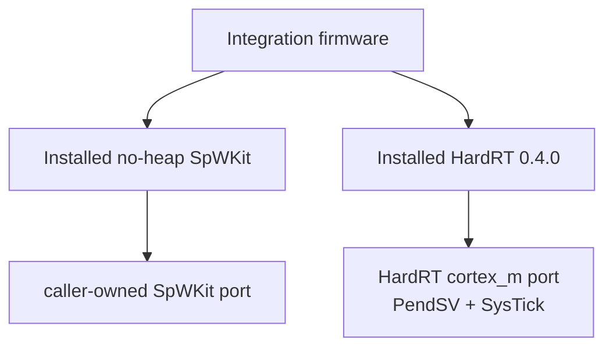

# HardRT Cortex-M7 integration

This fixture is the v0.5 bare-metal integration contract for SpWKit. It targets a precise architecture profile rather than claiming generic Cortex-M compatibility.

## Target profile

```text
target triple   : arm-none-eabi
CPU             : Cortex-M7 / ARMv7E-M
ISA             : Thumb
float ABI       : soft
SpWKit heap     : disabled
hosted backends : disabled
```

The profile matches the architectural class used by STM32H7 devices, including STM32H755, but the hosted CI job is **not** STM32H7 runtime HIL or electrical SpaceWire validation.

## Dependency model

The integration uses HardRT release `0.4.0`, pinned at its exact release commit:

```text
1b861393cd7967ce5d0b3ac6f45928828a2d63aa
```

Both HardRT and SpWKit are cross-built/staged separately, then this firmware consumes their exported CMake packages. No HardRT header/type becomes part of the SpWKit public ABI.



## Firmware evidence

The fixture links:

- the HardRT Cortex-M scheduler/port including PendSV assembly and SysTick support;
- a no-heap SpWKit loopback port using caller-owned aligned workspace;
- EEP DATA, a time code and statistics through the public SpWKit API.

The linker contract provides explicit FLASH/RAM regions and the symbols required by the validated HardRT Cortex-M port.

CI verifies the final ELF/map and rejects hosted socket/thread/C++ ABI leakage.

## Evidence boundary

This fixture is **compile/link/ABI evidence**. It does not claim that HardRT scheduling or this integration firmware executed on STM32H755 silicon.

Physical STM32H755 DMA/cache execution through the portable SpWKit DRIVER contract has since been qualified separately under #119, including phase-7 stale-buffer invalidation. That MCU evidence remains distinct from this HardRT compile/link fixture. Physical SpaceWire controller, FPGA/PHY and electrical interoperability remain later hardware/HIL evidence layers.
