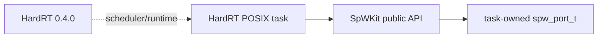

# HardRT POSIX integration

This standalone integration proves that an installed HardRT scheduler and an installed SpWKit package can be used together without coupling either library's runtime implementation.

## Dependency baseline

The integration uses the canonical HardRT release:

```text
ExoSpaceLabs/hardrt@0.4.0
```

Tag `0.4.0` resolves to commit:

```text
1b861393cd7967ce5d0b3ac6f45928828a2d63aa
```

SpWKit CI pins that exact release commit for reproducibility. HardRT's canonical tag intentionally has **no `v` prefix**; `v0.4.0` is not the release identity.

## Contract

The integration consumes installed CMake packages only:

```cmake
find_package(HardRT 0.4 CONFIG REQUIRED)
find_package(SpWKit 0.5 CONFIG REQUIRED)
```

Two HardRT POSIX tasks each own an independent SpWKit loopback port and validate:

- caller-owned/no-heap port construction;
- link start and capability queries;
- copied DATA with EOP and EEP;
- finite public API timeouts;
- SpaceWire time codes;
- statistics;
- clean port close.

Each task owns its own `spw_port_t`. This fixture does not imply that arbitrary concurrent calls into one shared port handle are supported.

## Dependency boundary

HardRT is an external integration dependency only. `libspwkit`, its exported CMake package and public headers contain no HardRT dependency or HardRT-specific application type.



The Cortex-M7 counterpart applies the same dependency rule with `arm-none-eabi`, the HardRT `cortex_m` port and SpWKit hosted backends disabled.
