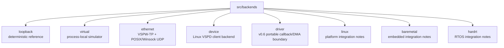

# Backends

Backends translate the portable SpWKit API into concrete virtual, hosted-device, or driver implementations.

Current layout:

The Linux DEVICE/VSPD runtime and `vspwd` shipped in v0.4; production CUSE `/dev/vspwX` and native Winsock UDP shipped in v0.5. The portable DRIVER backend and DMA ownership mapping are v0.6 development work.

Backend-specific concepts remain below the common application API. Native socket handles, file descriptors, CUSE/FUSE handles, AXI/register maps, DMA descriptors and RTOS primitives are implementation details rather than SpaceWire packet/link concepts.

Backend-specific public configuration may expose portable descriptive values required to select/configure an implementation, such as numeric IP address strings, UDP ports, `link_id`, virtual daemon port IDs or a versioned driver callback/context contract. Platform-native mechanism types remain private.
