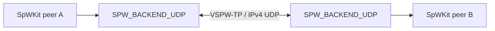

# Ethernet / distributed backend

This directory contains the distributed virtual SpaceWire transport implementation.

The v0.7 line includes:

- VSPW-TP v1 framing/validation;
- IPv4 UDP runtimes selected as `SPW_BACKEND_UDP` on POSIX hosts and native Winsock on Windows;
- bounded packet fragmentation/reassembly;
- EOP/EEP preservation;
- time-code transport;
- ACK/retransmission, duplicate suppression and sender-session restart recovery;
- configurable virtual rate/latency and deterministic transport/SpaceWire faults;
- active process, namespace and installed-package D2D coverage;
- installed-package CCSDSPack v2.0.0 PUS-C integration, including the isolated two-node Docker Compose topology.

The public UDP configuration and VSPW-TP wire contract are identical across POSIX and Windows. Socket lifecycle, addressing, readiness and carrier error translation are localized to the private UDP transport provider. Winsock compatibility remains private to the platform layer; no socket type is exposed through installed SpWKit headers.

The distributed stack is split into a carrier-independent VSPW engine and a
message-oriented transport-provider contract:

```text
SPW_BACKEND_UDP adapter
    -> VSPW engine
        -> transport provider
            -> POSIX/Winsock UDP
```

The VSPW engine owns session/reliability/reassembly, packet termination, time
codes, liveness, retry and protocol-visible fault state. The provider owns the
carrier. Provider MTU is validated when the engine is constructed.



The default UDP fragment payload is 1200 bytes. The current backend advertises a 1 MiB logical packet/reassembly limit even though the protocol framing can represent larger logical payloads.

Ethernet/IP is only the carrier. SpaceWire packet termination, packet boundaries, link semantics and time codes remain defined by SpWKit rather than inherited from UDP datagrams.

The VSPW-TP codec and engine are independent of socket APIs. Future raw-Ethernet or embedded providers can reuse the same engine without changing the application-facing API.
