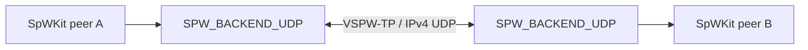

# Ethernet / distributed backend

This directory contains the distributed virtual SpaceWire transport implementation.

Stable v0.5 includes:

- VSPW-TP v1 framing/validation;
- IPv4 UDP runtimes selected as `SPW_BACKEND_UDP` on POSIX hosts and native Winsock on Windows;
- bounded packet fragmentation/reassembly;
- EOP/EEP preservation;
- time-code transport;
- ACK/retransmission, duplicate suppression and sender-session restart recovery;
- configurable virtual rate/latency and deterministic transport/SpaceWire faults;
- active process, namespace and installed-package D2D coverage.

The public UDP configuration and VSPW-TP wire contract are identical across POSIX and Windows. Winsock startup, `SOCKET` handles, readiness polling, monotonic timing and error translation stay inside the private Win32 compatibility layer; no Winsock type is exposed through installed SpWKit headers.

The default UDP fragment payload is 1200 bytes. The current backend advertises a 1 MiB logical packet/reassembly limit even though the protocol framing can represent larger logical payloads.

Ethernet/IP is only the carrier. SpaceWire packet termination, packet boundaries, link semantics and time codes remain defined by SpWKit rather than inherited from UDP datagrams.

`develop` additionally uses this backend in the two-node CCSDSPack PUS-C Docker Compose integration. The VSPW-TP codec remains independent of socket APIs so future embedded/lwIP transports can reuse the framing contract without changing the application-facing API.
