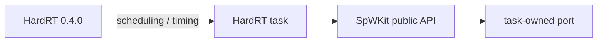

# HardRT integration notes

HardRT is an external RTOS/scheduler integration for deterministic SpaceWire application/backend execution. It is **not** a dependency of the generic SpWKit runtime or public ABI.

The validated baseline is HardRT release `0.4.0` at commit `1b861393cd7967ce5d0b3ac6f45928828a2d63aa`.

Current repository evidence includes:

- executed installed-package HardRT POSIX + SpWKit integration;
- Cortex-M7/ARMv7E-M no-heap compile/link integration with the HardRT `cortex_m` port;
- separation of HardRT task/scheduler types from the SpWKit public API;
- separate physical STM32H755 DMA/cache qualification through the portable DRIVER contract.

Future physical SpaceWire-driver integration may use HardRT events/semaphores/ISR notification below `SPW_BACKEND_DRIVER`, but those mechanisms must remain driver/platform details.

The HardRT Cortex-M7 fixture remains compile/link evidence. The completed STM32H755 qualification is a separate MCU DMA/cache runtime evidence layer and is not physical SpaceWire controller/PHY HIL.
