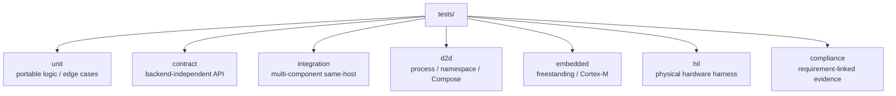
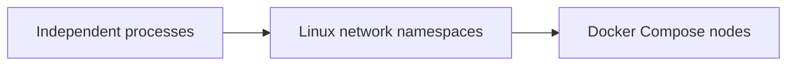

# Test suite layout

SpWKit tests are organized by verification level rather than implementation file.

Common CTest labels include `unit`, `contract`, `edge`, `example`, `simulator`, `integration`, `noheap`, `transport`, and `d2d`. Additional jobs exercise Linux DEVICE/VSPD, CUSE, HardRT, driver/DMA, installed packages and upper-layer integrations.

The common backend contract suite is intentionally central. New backends should reuse it rather than create their own interpretation of packet, EOP/EEP, link state, timeout, readiness, ownership or error semantics.

## Current distributed evidence

The D2D gate is no longer just localhost process traffic. Current CI includes:

The v0.6 CCSDSPack integration also runs a two-container PUS-C TC/TM exchange over VSPW-TP/UDP.

## Embedded and driver evidence

`embedded` is an active evidence layer, not future placeholder text. CI includes freestanding/no-heap builds and HardRT Cortex-M7 compile/link integration.

`develop` additionally includes `SPW_BACKEND_DRIVER`, driver/DMA ownership tests and a deterministic host reference driver.

STM32H755 runtime evidence remains pending #119 and physical SpaceWire HIL remains a later distinct layer.

See [docs/testing.md](../docs/testing.md) for execution policy, CI gates and evidence boundaries.
